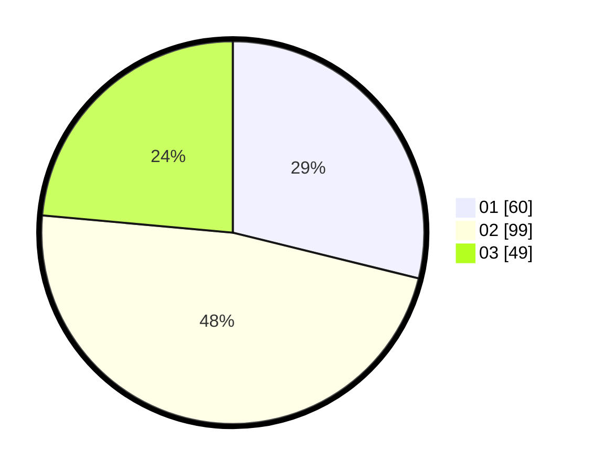

# Hasil

Hasil perolehan suara paslon dapat dilihat pada file paslon-01.txt, paslon-02.txt, dan paslon-03.txt.

Jika tidak ada, artinya data tersebut belum ada pada SIREKAP.

## Perolehan Suara

 * Paslon 01: **60**.
 * Paslon 02: **99**.
 * Paslon 03: **49**.

## Foto C Plano

https://sirekap-obj-formc.kpu.go.id/3b7c/pemilu/ppwp/31/75/09/10/01/3175091001008-20240216-123814--7002890d-aefa-42f2-8d32-5a965e49a7e2.jpg

https://sirekap-obj-formc.kpu.go.id/3b7c/pemilu/ppwp/31/75/09/10/01/3175091001008-20240216-130040--31a9648c-098a-481e-9b07-8109d2206399.jpg

https://sirekap-obj-formc.kpu.go.id/3b7c/pemilu/ppwp/31/75/09/10/01/3175091001008-20240216-131540--e636f792-dc48-497d-ada0-962689128612.jpg

## DATA PEMILIH TETAP

Jumlah pemilih dalam DPT: **212**.
 * L: **94**.
 * P: **118**.

## DATA PENGGUNA HAK PILIH

Jumlah pengguna hak pilih dalam DPT: **212**.
 * L: **94**.
 * P: **118**.

Jumlah pengguna hak pilih dalam DPTb: **0**.
 * L: **0**.
 * P: **0**.

Jumlah pengguna hak pilih dalam DPK: **1**.
 * L: **1**.
 * P: **0**.

Jumlah pengguna hak pilih: **213**.
 * L: **95**.
 * P: **118**.

## JUMLAH SUARA SAH DAN TIDAK SAH

JUMLAH SELURUH SUARA SAH: **208**.

JUMLAH SUARA TIDAK SAH: **5**.

JUMLAH SELURUH SUARA SAH DAN SUARA TIDAK SAH: **213**.
