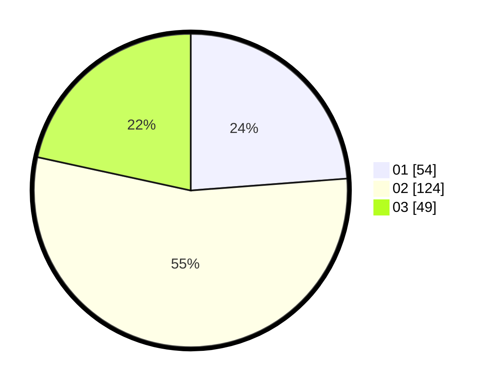

# Hasil

Hasil perolehan suara paslon dapat dilihat pada file paslon-01.txt, paslon-02.txt, dan paslon-03.txt.

Jika tidak ada, artinya data tersebut belum ada pada SIREKAP.

## Perolehan Suara

 * Paslon 01: **54**.
 * Paslon 02: **124**.
 * Paslon 03: **49**.

## Foto C Plano

https://sirekap-obj-formc.kpu.go.id/b367/pemilu/ppwp/31/75/09/10/01/3175091001009-20240218-155620--7dc9ec27-ca10-491a-bebd-27febe887aa4.jpg

https://sirekap-obj-formc.kpu.go.id/b367/pemilu/ppwp/31/75/09/10/01/3175091001009-20240218-155622--c160f8bf-cb4b-4f20-b0a3-d2f47dbd17ee.jpg

https://sirekap-obj-formc.kpu.go.id/b367/pemilu/ppwp/31/75/09/10/01/3175091001009-20240218-155621--ef3dbd40-4f30-4d63-a67d-f57750a2ad02.jpg

## DATA PEMILIH TETAP

Jumlah pemilih dalam DPT: **288**.
 * L: **151**.
 * P: **137**.

## DATA PENGGUNA HAK PILIH

Jumlah pengguna hak pilih dalam DPT: **224**.
 * L: **109**.
 * P: **115**.

Jumlah pengguna hak pilih dalam DPTb: **0**.
 * L: **0**.
 * P: **0**.

Jumlah pengguna hak pilih dalam DPK: **4**.
 * L: **1**.
 * P: **3**.

Jumlah pengguna hak pilih: **228**.
 * L: **110**.
 * P: **118**.

## JUMLAH SUARA SAH DAN TIDAK SAH

JUMLAH SELURUH SUARA SAH: **227**.

JUMLAH SUARA TIDAK SAH: **1**.

JUMLAH SELURUH SUARA SAH DAN SUARA TIDAK SAH: **228**.
