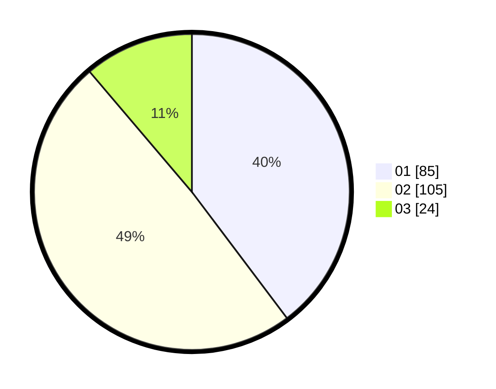

# Hasil

Hasil perolehan suara paslon dapat dilihat pada file paslon-01.txt, paslon-02.txt, dan paslon-03.txt.

Jika tidak ada, artinya data tersebut belum ada pada SIREKAP.

## Perolehan Suara

 * Paslon 01: **85**.
 * Paslon 02: **105**.
 * Paslon 03: **24**.

## Foto C Plano

https://sirekap-obj-formc.kpu.go.id/7fae/pemilu/ppwp/31/75/09/10/01/3175091001018-20240216-114241--1e9789d9-9462-41a2-8528-b6f507a4b469.jpg

https://sirekap-obj-formc.kpu.go.id/7fae/pemilu/ppwp/31/75/09/10/01/3175091001018-20240216-113426--7d0ade4a-f9f3-4ed3-8983-4fe0b26c6f12.jpg

https://sirekap-obj-formc.kpu.go.id/7fae/pemilu/ppwp/31/75/09/10/01/3175091001018-20240216-115227--ac59b086-1943-463b-9da7-bfbc921695a3.jpg

## DATA PEMILIH TETAP

Jumlah pemilih dalam DPT: **283**.
 * L: **144**.
 * P: **139**.

## DATA PENGGUNA HAK PILIH

Jumlah pengguna hak pilih dalam DPT: **212**.
 * L: **101**.
 * P: **111**.

Jumlah pengguna hak pilih dalam DPTb: **2**.
 * L: **2**.
 * P: **0**.

Jumlah pengguna hak pilih dalam DPK: **9**.
 * L: **4**.
 * P: **5**.

Jumlah pengguna hak pilih: **223**.
 * L: **107**.
 * P: **116**.

## JUMLAH SUARA SAH DAN TIDAK SAH

JUMLAH SELURUH SUARA SAH: **214**.

JUMLAH SUARA TIDAK SAH: **9**.

JUMLAH SELURUH SUARA SAH DAN SUARA TIDAK SAH: **223**.
