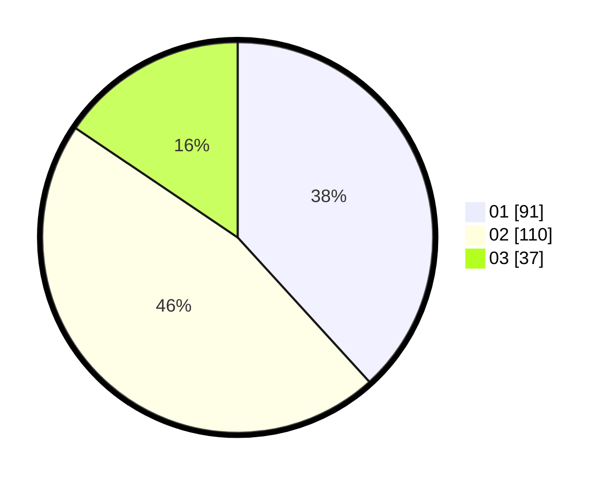

# Hasil

Hasil perolehan suara paslon dapat dilihat pada file paslon-01.txt, paslon-02.txt, dan paslon-03.txt.

Jika tidak ada, artinya data tersebut belum ada pada SIREKAP.

## Perolehan Suara

 * Paslon 01: **91**.
 * Paslon 02: **110**.
 * Paslon 03: **37**.

## Foto C Plano

https://sirekap-obj-formc.kpu.go.id/7982/pemilu/ppwp/31/75/09/10/01/3175091001022-20240216-132148--3ca4d819-92fc-47b1-8f82-7267f55b44c9.jpg

https://sirekap-obj-formc.kpu.go.id/7982/pemilu/ppwp/31/75/09/10/01/3175091001022-20240216-132150--92e59aa5-ad4c-451f-9985-8a7e9cc99388.jpg

https://sirekap-obj-formc.kpu.go.id/7982/pemilu/ppwp/31/75/09/10/01/3175091001022-20240216-132149--eb040f8d-cf70-4db9-ba1c-5882e11bd437.jpg

## DATA PEMILIH TETAP

Jumlah pemilih dalam DPT: **280**.
 * L: **137**.
 * P: **143**.

## DATA PENGGUNA HAK PILIH

Jumlah pengguna hak pilih dalam DPT: **242**.
 * L: **116**.
 * P: **126**.

Jumlah pengguna hak pilih dalam DPTb: **0**.
 * L: **0**.
 * P: **0**.

Jumlah pengguna hak pilih dalam DPK: **0**.
 * L: **0**.
 * P: **0**.

Jumlah pengguna hak pilih: **242**.
 * L: **116**.
 * P: **126**.

## JUMLAH SUARA SAH DAN TIDAK SAH

JUMLAH SELURUH SUARA SAH: **238**.

JUMLAH SUARA TIDAK SAH: **4**.

JUMLAH SELURUH SUARA SAH DAN SUARA TIDAK SAH: **242**.
