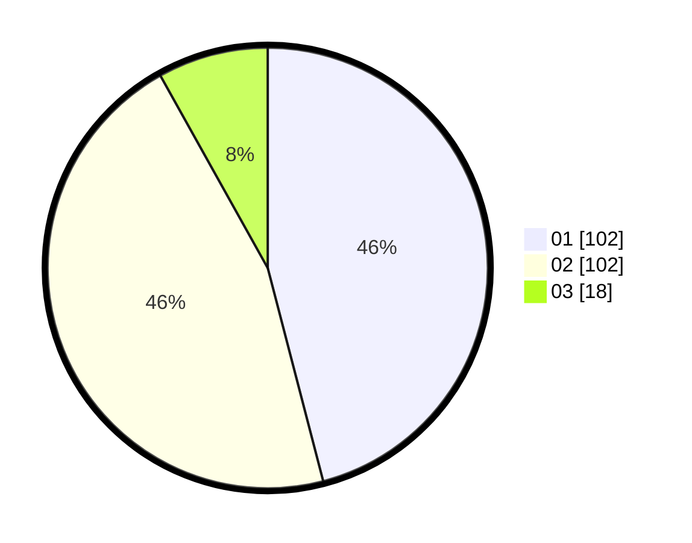

# Hasil

Hasil perolehan suara paslon dapat dilihat pada file paslon-01.txt, paslon-02.txt, dan paslon-03.txt.

Jika tidak ada, artinya data tersebut belum ada pada SIREKAP.

## Perolehan Suara

 * Paslon 01: **102**.
 * Paslon 02: **102**.
 * Paslon 03: **18**.

## Foto C Plano

https://sirekap-obj-formc.kpu.go.id/069d/pemilu/ppwp/31/75/09/10/01/3175091001026-20240214-201554--97993778-4424-43d6-b95e-33f105e78086.jpg

https://sirekap-obj-formc.kpu.go.id/069d/pemilu/ppwp/31/75/09/10/01/3175091001026-20240214-141206--78471bbe-04c6-4df7-9833-43166ae985cf.jpg

https://sirekap-obj-formc.kpu.go.id/069d/pemilu/ppwp/31/75/09/10/01/3175091001026-20240214-235558--40983452-88bd-4cbd-b97b-8c933539ce81.jpg
