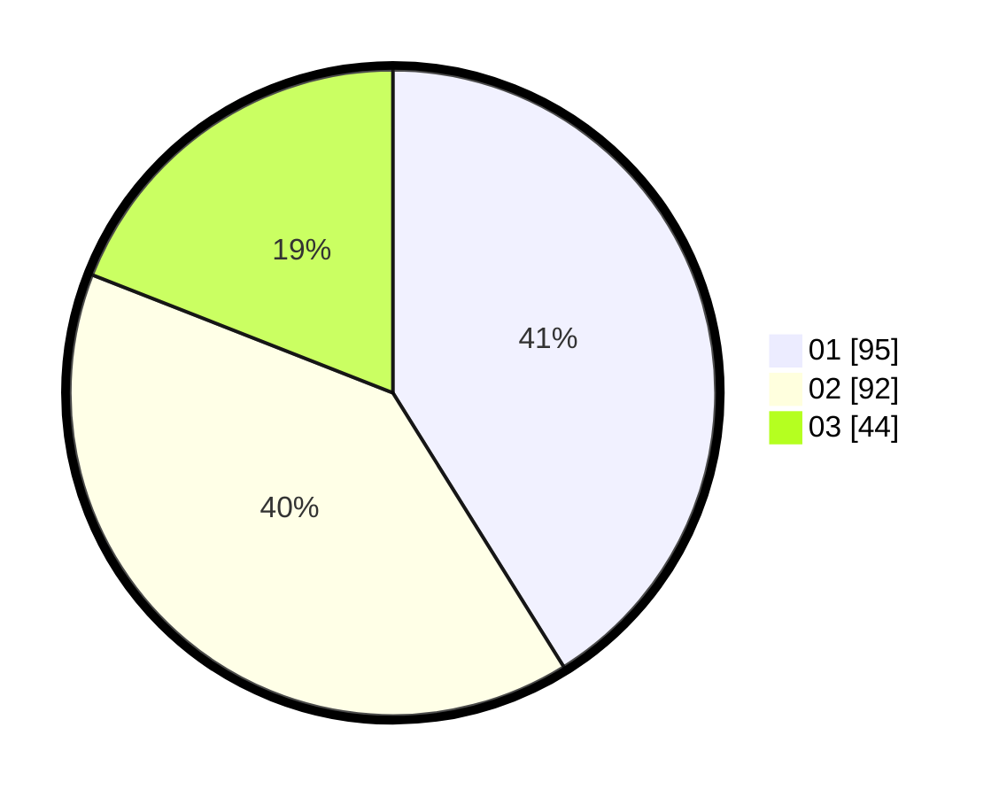

# Hasil

Hasil perolehan suara paslon dapat dilihat pada file paslon-01.txt, paslon-02.txt, dan paslon-03.txt.

Jika tidak ada, artinya data tersebut belum ada pada SIREKAP.

## Perolehan Suara

 * Paslon 01: **95**.
 * Paslon 02: **92**.
 * Paslon 03: **44**.

## Foto C Plano

https://sirekap-obj-formc.kpu.go.id/1c88/pemilu/ppwp/31/75/09/10/01/3175091001027-20240214-203809--f4e1aaa9-f115-4d96-bb9d-dc97d1fbd35f.jpg

https://sirekap-obj-formc.kpu.go.id/1c88/pemilu/ppwp/31/75/09/10/01/3175091001027-20240214-203928--f76717c9-45e2-4ee7-9e9b-264cb10f2bc4.jpg

https://sirekap-obj-formc.kpu.go.id/1c88/pemilu/ppwp/31/75/09/10/01/3175091001027-20240214-204055--ae4eaddc-525a-4b85-8d8c-a988ac20299b.jpg

## DATA PEMILIH TETAP

Jumlah pemilih dalam DPT: **288**.
 * L: **143**.
 * P: **145**.

## DATA PENGGUNA HAK PILIH

Jumlah pengguna hak pilih dalam DPT: **230**.
 * L: **110**.
 * P: **120**.

Jumlah pengguna hak pilih dalam DPTb: **3**.
 * L: **1**.
 * P: **2**.

Jumlah pengguna hak pilih dalam DPK: **0**.
 * L: **0**.
 * P: **0**.

Jumlah pengguna hak pilih: **233**.
 * L: **111**.
 * P: **122**.

## JUMLAH SUARA SAH DAN TIDAK SAH

JUMLAH SELURUH SUARA SAH: **231**.

JUMLAH SUARA TIDAK SAH: **2**.

JUMLAH SELURUH SUARA SAH DAN SUARA TIDAK SAH: **233**.
