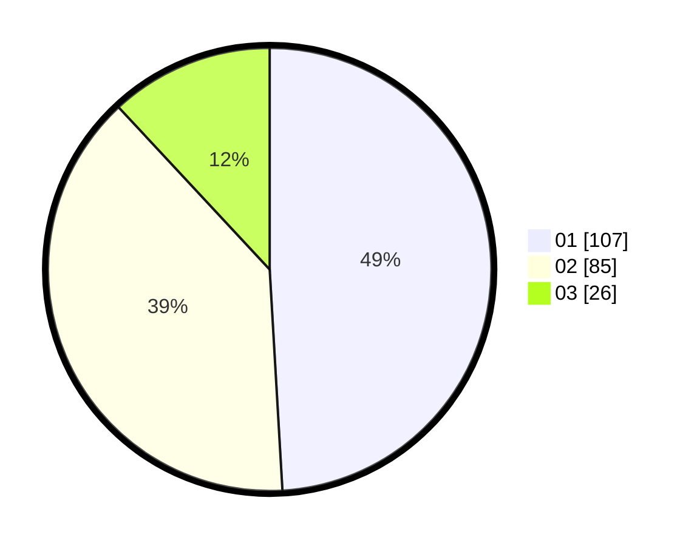

# Hasil

Hasil perolehan suara paslon dapat dilihat pada file paslon-01.txt, paslon-02.txt, dan paslon-03.txt.

Jika tidak ada, artinya data tersebut belum ada pada SIREKAP.

## Perolehan Suara

 * Paslon 01: **107**.
 * Paslon 02: **85**.
 * Paslon 03: **26**.

## Foto C Plano

https://sirekap-obj-formc.kpu.go.id/b9ec/pemilu/ppwp/31/75/09/10/01/3175091001028-20240216-182218--b9102a58-a7a1-4689-b0a4-94495fdf07ee.jpg

https://sirekap-obj-formc.kpu.go.id/b9ec/pemilu/ppwp/31/75/09/10/01/3175091001028-20240216-182219--4c7a4487-fffa-484b-99a1-1102edab6b8f.jpg

https://sirekap-obj-formc.kpu.go.id/b9ec/pemilu/ppwp/31/75/09/10/01/3175091001028-20240216-182218--cdd98909-6e0b-4ed5-8d9b-35de11685551.jpg

## DATA PEMILIH TETAP

Jumlah pemilih dalam DPT: **280**.
 * L: **138**.
 * P: **142**.

## DATA PENGGUNA HAK PILIH

Jumlah pengguna hak pilih dalam DPT: **219**.
 * L: **103**.
 * P: **116**.

Jumlah pengguna hak pilih dalam DPTb: **0**.
 * L: **0**.
 * P: **0**.

Jumlah pengguna hak pilih dalam DPK: **1**.
 * L: **0**.
 * P: **1**.

Jumlah pengguna hak pilih: **220**.
 * L: **103**.
 * P: **117**.

## JUMLAH SUARA SAH DAN TIDAK SAH

JUMLAH SELURUH SUARA SAH: **218**.

JUMLAH SUARA TIDAK SAH: **2**.

JUMLAH SELURUH SUARA SAH DAN SUARA TIDAK SAH: **220**.
