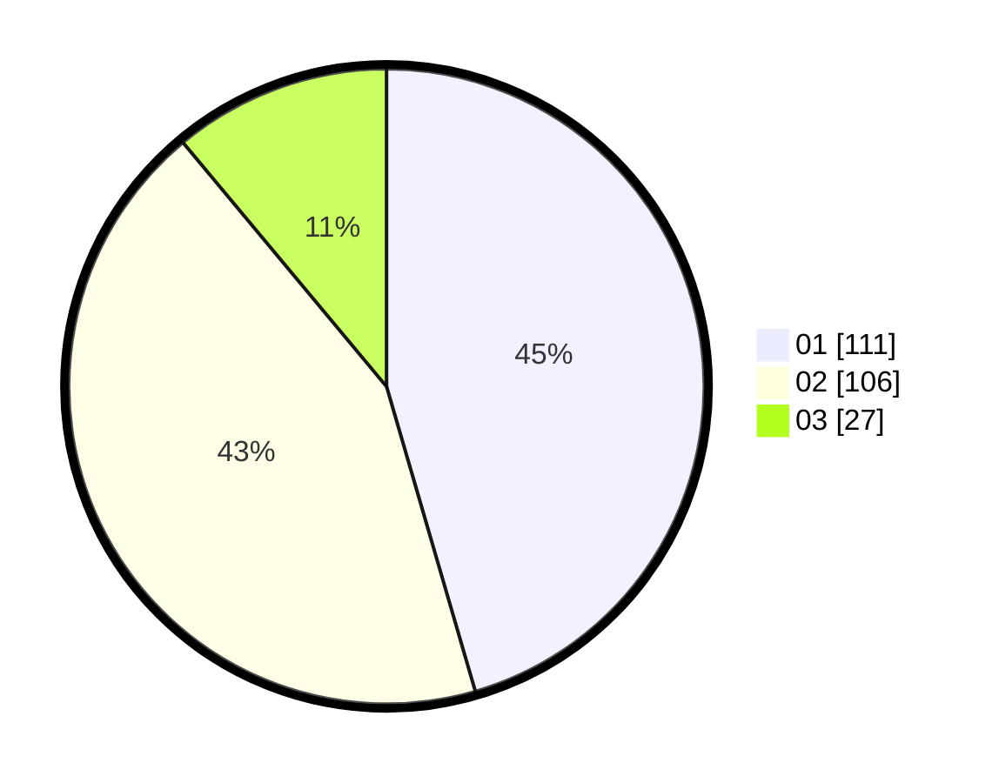

# Hasil

Hasil perolehan suara paslon dapat dilihat pada file paslon-01.txt, paslon-02.txt, dan paslon-03.txt.

Jika tidak ada, artinya data tersebut belum ada pada SIREKAP.

## Perolehan Suara

 * Paslon 01: **111**.
 * Paslon 02: **106**.
 * Paslon 03: **27**.

## Foto C Plano

https://sirekap-obj-formc.kpu.go.id/31d1/pemilu/ppwp/31/75/09/10/01/3175091001029-20240216-094755--0fb0dda4-f933-4f33-86ef-e72bf6973d6a.jpg

https://sirekap-obj-formc.kpu.go.id/31d1/pemilu/ppwp/31/75/09/10/01/3175091001029-20240216-094808--b4771614-3dc6-4de8-9165-2dfdd23a1b3e.jpg

https://sirekap-obj-formc.kpu.go.id/31d1/pemilu/ppwp/31/75/09/10/01/3175091001029-20240216-094759--df4450bc-2040-44dc-a7cd-3d96937e5bfa.jpg

## DATA PEMILIH TETAP

Jumlah pemilih dalam DPT: **277**.
 * L: **137**.
 * P: **140**.

## DATA PENGGUNA HAK PILIH

Jumlah pengguna hak pilih dalam DPT: **239**.
 * L: **117**.
 * P: **122**.

Jumlah pengguna hak pilih dalam DPTb: **1**.
 * L: **1**.
 * P: **0**.

Jumlah pengguna hak pilih dalam DPK: **6**.
 * L: **3**.
 * P: **3**.

Jumlah pengguna hak pilih: **246**.
 * L: **121**.
 * P: **125**.

## JUMLAH SUARA SAH DAN TIDAK SAH

JUMLAH SELURUH SUARA SAH: **244**.

JUMLAH SUARA TIDAK SAH: **2**.

JUMLAH SELURUH SUARA SAH DAN SUARA TIDAK SAH: **246**.
