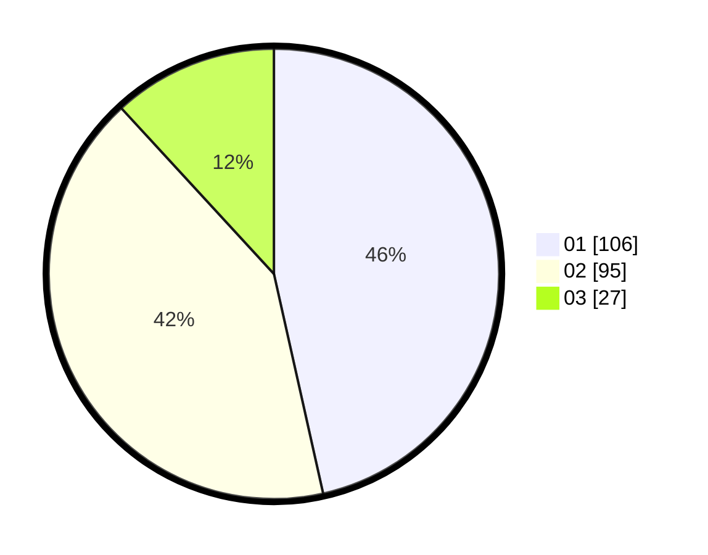

# Hasil

Hasil perolehan suara paslon dapat dilihat pada file paslon-01.txt, paslon-02.txt, dan paslon-03.txt.

Jika tidak ada, artinya data tersebut belum ada pada SIREKAP.

## Perolehan Suara

 * Paslon 01: **106**.
 * Paslon 02: **95**.
 * Paslon 03: **27**.

## Foto C Plano

https://sirekap-obj-formc.kpu.go.id/7e14/pemilu/ppwp/31/75/09/10/01/3175091001031-20240214-155628--955761f5-41bc-4130-88fe-f5f209d8d720.jpg

https://sirekap-obj-formc.kpu.go.id/7e14/pemilu/ppwp/31/75/09/10/01/3175091001031-20240214-191939--7f3915ea-8282-447f-8f21-cffd0c41e1eb.jpg
