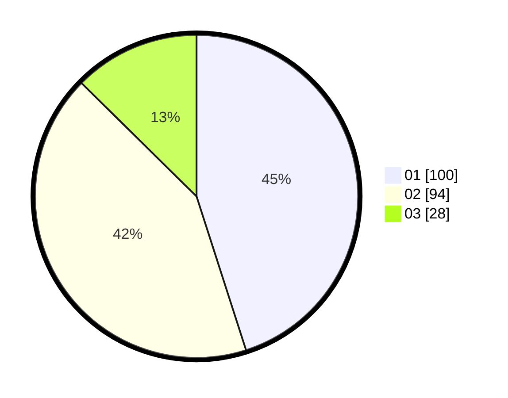

# Hasil

Hasil perolehan suara paslon dapat dilihat pada file paslon-01.txt, paslon-02.txt, dan paslon-03.txt.

Jika tidak ada, artinya data tersebut belum ada pada SIREKAP.

## Perolehan Suara

 * Paslon 01: **100**.
 * Paslon 02: **94**.
 * Paslon 03: **28**.

## Foto C Plano

https://sirekap-obj-formc.kpu.go.id/0682/pemilu/ppwp/31/75/09/10/01/3175091001034-20240215-001808--a46c4024-596e-4b31-a04c-692a84f04513.jpg

https://sirekap-obj-formc.kpu.go.id/0682/pemilu/ppwp/31/75/09/10/01/3175091001034-20240215-204308--56ea452a-3842-4518-99cd-44c7f443c5bf.jpg

https://sirekap-obj-formc.kpu.go.id/0682/pemilu/ppwp/31/75/09/10/01/3175091001034-20240216-200933--80a6d533-5c45-4c42-b4c6-b23d3f5b70ac.jpg

## DATA PEMILIH TETAP

Jumlah pemilih dalam DPT: **280**.
 * L: **139**.
 * P: **141**.

## DATA PENGGUNA HAK PILIH

Jumlah pengguna hak pilih dalam DPT: **218**.
 * L: **104**.
 * P: **114**.

Jumlah pengguna hak pilih dalam DPTb: **0**.
 * L: **0**.
 * P: **0**.

Jumlah pengguna hak pilih dalam DPK: **0**.
 * L: **0**.
 * P: **0**.

Jumlah pengguna hak pilih: **218**.
 * L: **104**.
 * P: **114**.

## JUMLAH SUARA SAH DAN TIDAK SAH

JUMLAH SELURUH SUARA SAH: **222**.

JUMLAH SUARA TIDAK SAH: **2**.

JUMLAH SELURUH SUARA SAH DAN SUARA TIDAK SAH: **224**.
