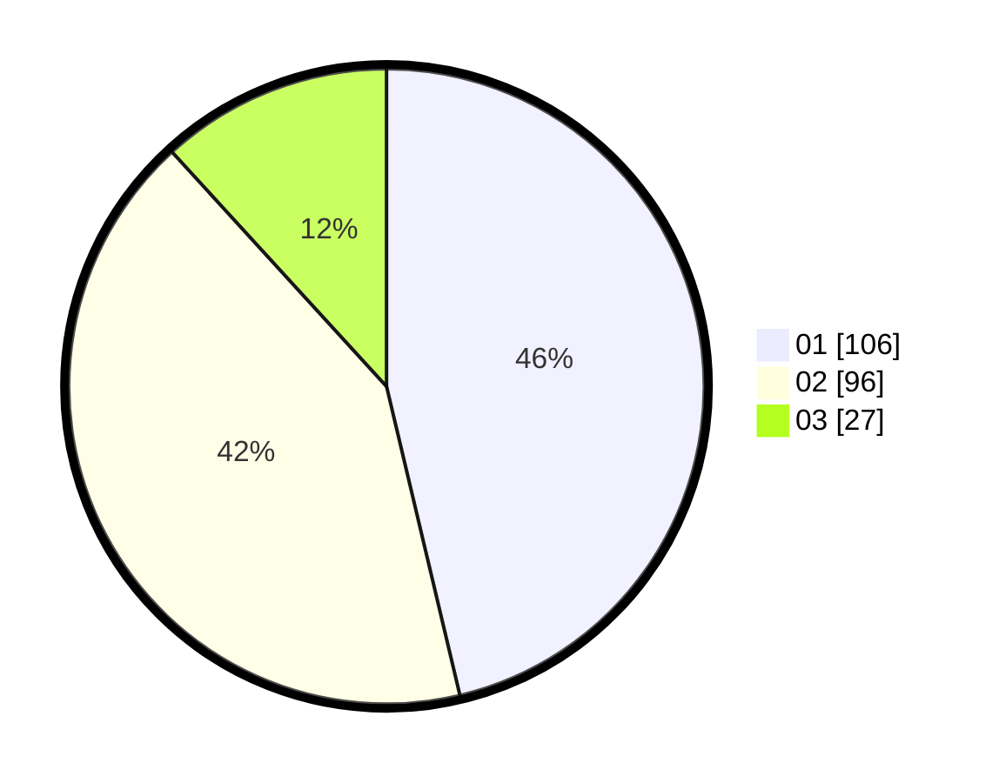

# Hasil

Hasil perolehan suara paslon dapat dilihat pada file paslon-01.txt, paslon-02.txt, dan paslon-03.txt.

Jika tidak ada, artinya data tersebut belum ada pada SIREKAP.

## Perolehan Suara

 * Paslon 01: **106**.
 * Paslon 02: **96**.
 * Paslon 03: **27**.

## Foto C Plano

https://sirekap-obj-formc.kpu.go.id/3300/pemilu/ppwp/31/75/09/10/01/3175091001035-20240214-155609--82960e09-d321-4009-9b28-76f94b93ebd6.jpg

https://sirekap-obj-formc.kpu.go.id/3300/pemilu/ppwp/31/75/09/10/01/3175091001035-20240214-155635--5427abae-2765-4337-8142-7d8c300a0b8f.jpg

https://sirekap-obj-formc.kpu.go.id/3300/pemilu/ppwp/31/75/09/10/01/3175091001035-20240214-155701--8e77483a-2c90-4694-95b5-854f2b28b3e2.jpg
