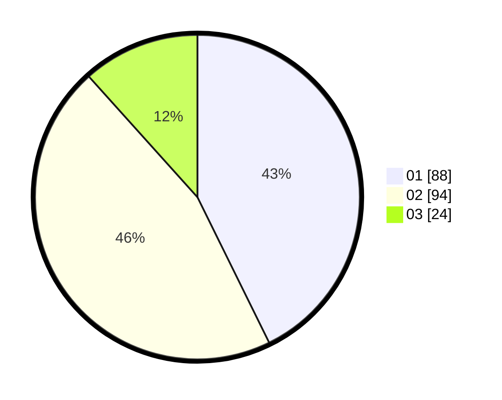

# Hasil

Hasil perolehan suara paslon dapat dilihat pada file paslon-01.txt, paslon-02.txt, dan paslon-03.txt.

Jika tidak ada, artinya data tersebut belum ada pada SIREKAP.

## Perolehan Suara

 * Paslon 01: **88**.
 * Paslon 02: **94**.
 * Paslon 03: **24**.

## Foto C Plano

https://sirekap-obj-formc.kpu.go.id/3231/pemilu/ppwp/31/75/09/10/01/3175091001037-20240214-233501--223d0898-5124-44e5-9cba-2c7f01b2042d.jpg

https://sirekap-obj-formc.kpu.go.id/3231/pemilu/ppwp/31/75/09/10/01/3175091001037-20240214-233540--dad63daa-1e32-42eb-89ac-da6df2668487.jpg

https://sirekap-obj-formc.kpu.go.id/3231/pemilu/ppwp/31/75/09/10/01/3175091001037-20240214-233557--3cffd336-70c5-4ef6-bdeb-f514851b3542.jpg

## DATA PEMILIH TETAP

Jumlah pemilih dalam DPT: **249**.
 * L: **126**.
 * P: **123**.

## DATA PENGGUNA HAK PILIH

Jumlah pengguna hak pilih dalam DPT: **206**.
 * L: **101**.
 * P: **105**.

Jumlah pengguna hak pilih dalam DPTb: **0**.
 * L: **0**.
 * P: **0**.

Jumlah pengguna hak pilih dalam DPK: **1**.
 * L: **0**.
 * P: **1**.

Jumlah pengguna hak pilih: **207**.
 * L: **101**.
 * P: **106**.

## JUMLAH SUARA SAH DAN TIDAK SAH

JUMLAH SELURUH SUARA SAH: **206**.

JUMLAH SUARA TIDAK SAH: **1**.

JUMLAH SELURUH SUARA SAH DAN SUARA TIDAK SAH: **207**.
