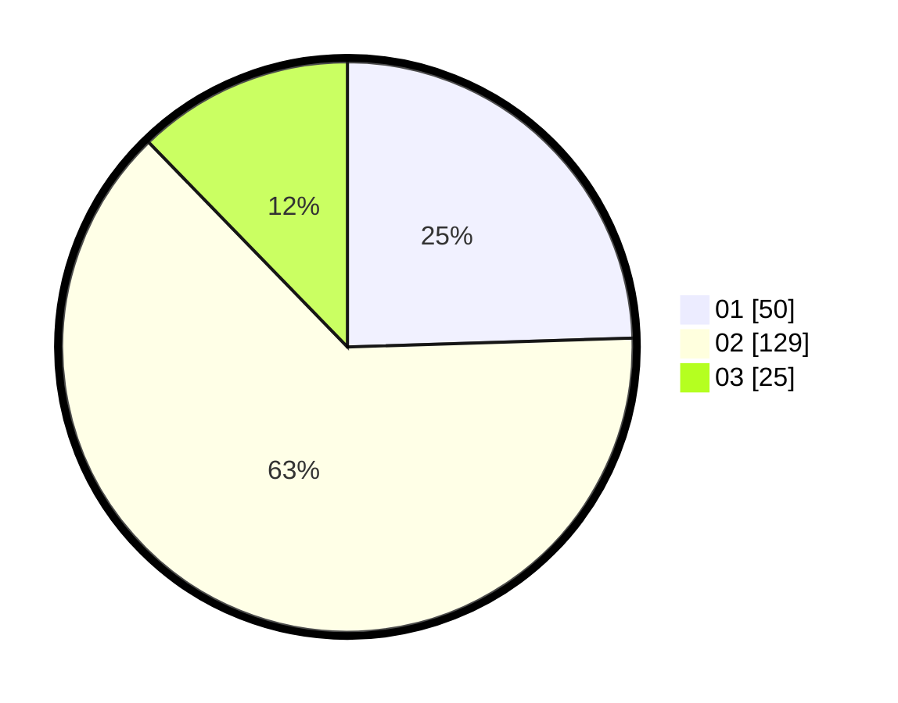

# Hasil

Hasil perolehan suara paslon dapat dilihat pada file paslon-01.txt, paslon-02.txt, dan paslon-03.txt.

Jika tidak ada, artinya data tersebut belum ada pada SIREKAP.

## Perolehan Suara

 * Paslon 01: **50**.
 * Paslon 02: **129**.
 * Paslon 03: **25**.

## Foto C Plano

https://sirekap-obj-formc.kpu.go.id/af65/pemilu/ppwp/31/75/09/10/01/3175091001040-20240216-082719--cc5e2bb2-fbe2-41be-8936-dbd82915e7be.jpg

https://sirekap-obj-formc.kpu.go.id/af65/pemilu/ppwp/31/75/09/10/01/3175091001040-20240216-082721--76f5b9de-1eb2-4210-89b3-6639c54eb471.jpg

https://sirekap-obj-formc.kpu.go.id/af65/pemilu/ppwp/31/75/09/10/01/3175091001040-20240216-082720--79db22f8-17e4-4e25-8e4b-9d1f25cfd6ab.jpg

## DATA PEMILIH TETAP

Jumlah pemilih dalam DPT: **271**.
 * L: **120**.
 * P: **151**.

## DATA PENGGUNA HAK PILIH

Jumlah pengguna hak pilih dalam DPT: **204**.
 * L: **86**.
 * P: **118**.

Jumlah pengguna hak pilih dalam DPTb: **0**.
 * L: **0**.
 * P: **0**.

Jumlah pengguna hak pilih dalam DPK: **3**.
 * L: **1**.
 * P: **2**.

Jumlah pengguna hak pilih: **207**.
 * L: **87**.
 * P: **120**.

## JUMLAH SUARA SAH DAN TIDAK SAH

JUMLAH SELURUH SUARA SAH: **204**.

JUMLAH SUARA TIDAK SAH: **3**.

JUMLAH SELURUH SUARA SAH DAN SUARA TIDAK SAH: **207**.
