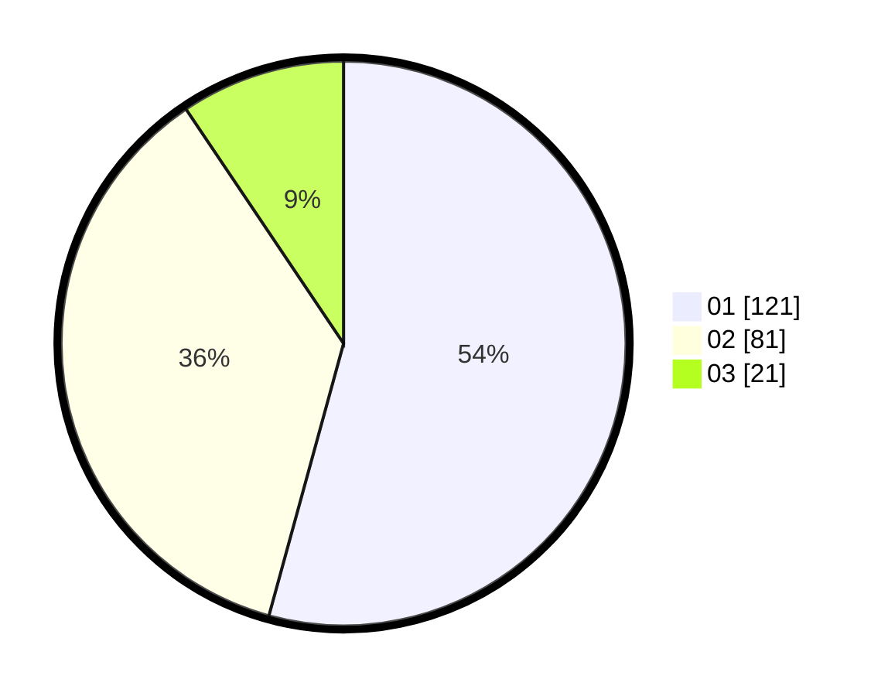

# Hasil

Hasil perolehan suara paslon dapat dilihat pada file paslon-01.txt, paslon-02.txt, dan paslon-03.txt.

Jika tidak ada, artinya data tersebut belum ada pada SIREKAP.

## Perolehan Suara

 * Paslon 01: **121**.
 * Paslon 02: **81**.
 * Paslon 03: **21**.

## Foto C Plano

https://sirekap-obj-formc.kpu.go.id/142d/pemilu/ppwp/31/75/09/10/01/3175091001042-20240217-105604--d393b662-7da8-457c-ae8f-c5745c28ac81.jpg

https://sirekap-obj-formc.kpu.go.id/142d/pemilu/ppwp/31/75/09/10/01/3175091001042-20240216-105158--5e43cd6d-ecc0-4337-9b9e-d69bfc72fb50.jpg

https://sirekap-obj-formc.kpu.go.id/142d/pemilu/ppwp/31/75/09/10/01/3175091001042-20240216-203408--18103841-c547-41d3-89f3-40e98aa7b14e.jpg
