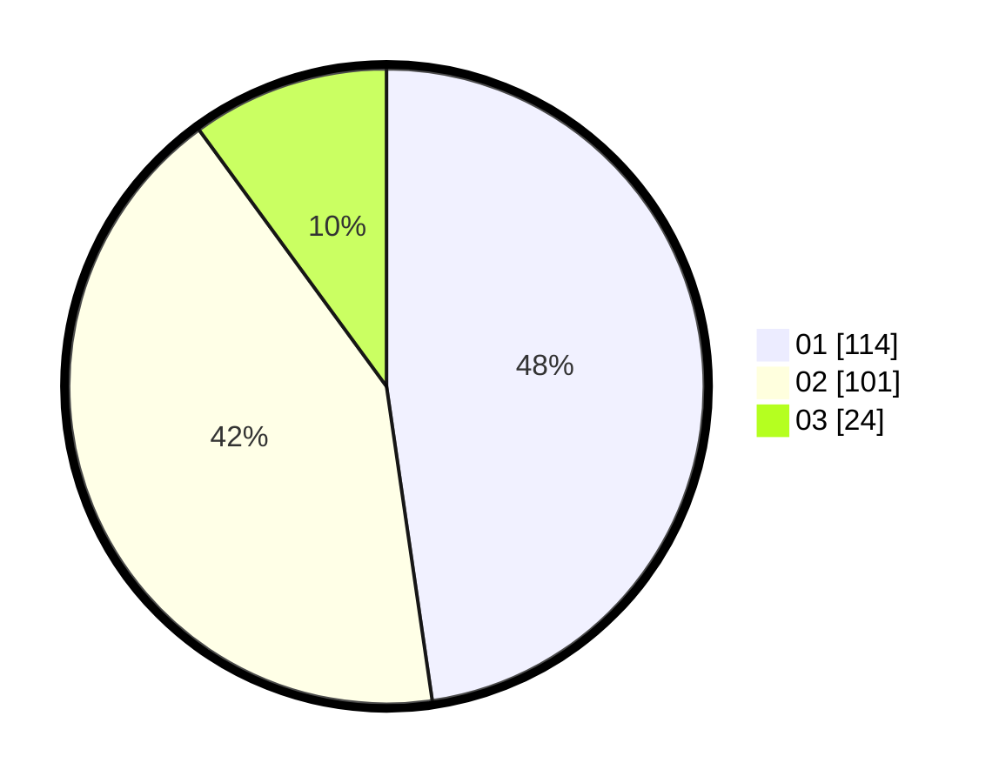

# Hasil

Hasil perolehan suara paslon dapat dilihat pada file paslon-01.txt, paslon-02.txt, dan paslon-03.txt.

Jika tidak ada, artinya data tersebut belum ada pada SIREKAP.

## Perolehan Suara

 * Paslon 01: **114**.
 * Paslon 02: **101**.
 * Paslon 03: **24**.

## Foto C Plano

https://sirekap-obj-formc.kpu.go.id/dd07/pemilu/ppwp/31/75/09/10/01/3175091001044-20240216-210324--94662c9f-5c06-45ab-a025-692d15e825fa.jpg

https://sirekap-obj-formc.kpu.go.id/dd07/pemilu/ppwp/31/75/09/10/01/3175091001044-20240216-210326--c93db031-2dd2-467e-ba28-9672c95f45bb.jpg

https://sirekap-obj-formc.kpu.go.id/dd07/pemilu/ppwp/31/75/09/10/01/3175091001044-20240216-210325--99e67a54-7f02-4f2f-b333-d23b94c62837.jpg

## DATA PEMILIH TETAP

Jumlah pemilih dalam DPT: **240**.
 * L: **112**.
 * P: **128**.

## DATA PENGGUNA HAK PILIH

Jumlah pengguna hak pilih dalam DPT: **240**.
 * L: **112**.
 * P: **128**.

Jumlah pengguna hak pilih dalam DPTb: **3**.
 * L: **2**.
 * P: **1**.

Jumlah pengguna hak pilih dalam DPK: **1**.
 * L: **0**.
 * P: **1**.

Jumlah pengguna hak pilih: **244**.
 * L: **114**.
 * P: **130**.

## JUMLAH SUARA SAH DAN TIDAK SAH

JUMLAH SELURUH SUARA SAH: **239**.

JUMLAH SUARA TIDAK SAH: **5**.

JUMLAH SELURUH SUARA SAH DAN SUARA TIDAK SAH: **244**.
