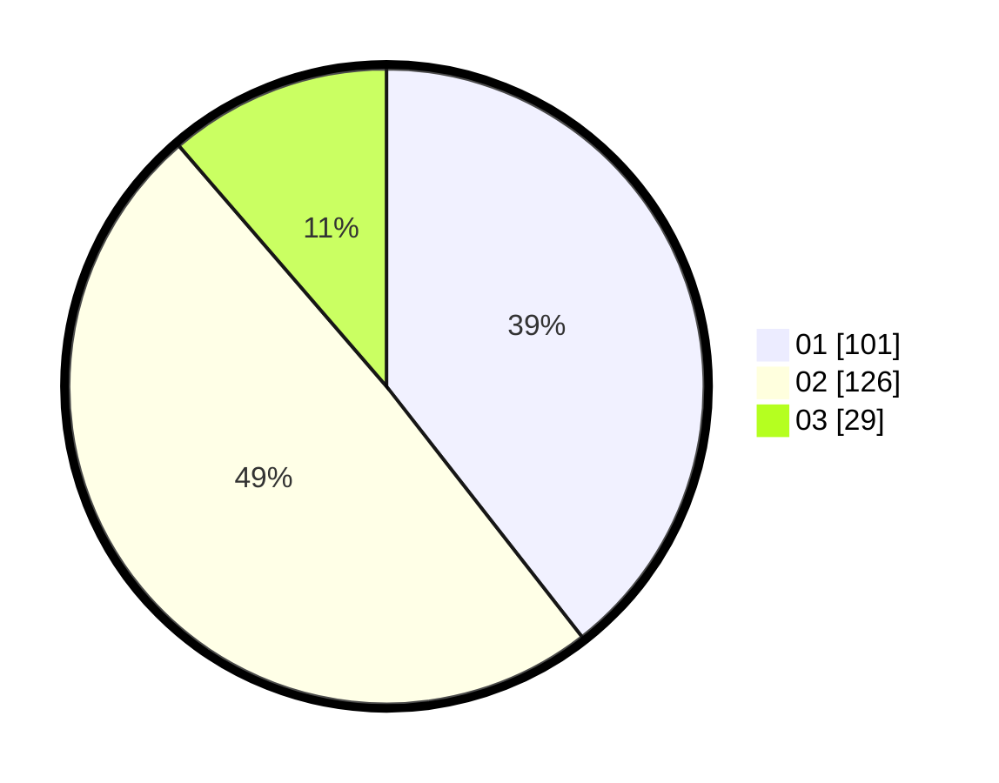

# Hasil

Hasil perolehan suara paslon dapat dilihat pada file paslon-01.txt, paslon-02.txt, dan paslon-03.txt.

Jika tidak ada, artinya data tersebut belum ada pada SIREKAP.

## Perolehan Suara

 * Paslon 01: **101**.
 * Paslon 02: **126**.
 * Paslon 03: **29**.

## Foto C Plano

https://sirekap-obj-formc.kpu.go.id/e20a/pemilu/ppwp/31/75/09/10/01/3175091001045-20240216-092320--fb7d21b6-18bd-4f50-bff1-ea126e5a9d17.jpg

https://sirekap-obj-formc.kpu.go.id/e20a/pemilu/ppwp/31/75/09/10/01/3175091001045-20240216-093531--8ca793ae-d8eb-4ad5-97d3-ccca9ce12eca.jpg

https://sirekap-obj-formc.kpu.go.id/e20a/pemilu/ppwp/31/75/09/10/01/3175091001045-20240216-095115--de1f933c-ae7d-40d0-ae8c-44b94c47c5c9.jpg

## DATA PEMILIH TETAP

Jumlah pemilih dalam DPT: **290**.
 * L: **150**.
 * P: **140**.

## DATA PENGGUNA HAK PILIH

Jumlah pengguna hak pilih dalam DPT: **256**.
 * L: **126**.
 * P: **130**.

Jumlah pengguna hak pilih dalam DPTb: **0**.
 * L: **0**.
 * P: **0**.

Jumlah pengguna hak pilih dalam DPK: **6**.
 * L: **2**.
 * P: **4**.

Jumlah pengguna hak pilih: **262**.
 * L: **128**.
 * P: **134**.

## JUMLAH SUARA SAH DAN TIDAK SAH

JUMLAH SELURUH SUARA SAH: **256**.

JUMLAH SUARA TIDAK SAH: **0**.

JUMLAH SELURUH SUARA SAH DAN SUARA TIDAK SAH: **256**.
