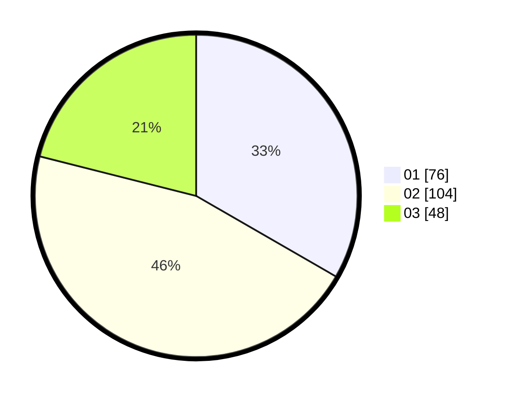

# Hasil

Hasil perolehan suara paslon dapat dilihat pada file paslon-01.txt, paslon-02.txt, dan paslon-03.txt.

Jika tidak ada, artinya data tersebut belum ada pada SIREKAP.

## Perolehan Suara

 * Paslon 01: **76**.
 * Paslon 02: **104**.
 * Paslon 03: **48**.

## Foto C Plano

https://sirekap-obj-formc.kpu.go.id/ecb3/pemilu/ppwp/31/75/09/10/01/3175091001047-20240214-230443--6286dd53-3ce5-4aa5-b0ce-8ebeeaffba05.jpg

https://sirekap-obj-formc.kpu.go.id/ecb3/pemilu/ppwp/31/75/09/10/01/3175091001047-20240216-132229--dfa6d777-90d2-48d6-a923-8ed74e8c9820.jpg

https://sirekap-obj-formc.kpu.go.id/ecb3/pemilu/ppwp/31/75/09/10/01/3175091001047-20240216-132229--1d0d362c-671b-409f-a93b-4901c448ca28.jpg

## DATA PEMILIH TETAP

Jumlah pemilih dalam DPT: **288**.
 * L: **152**.
 * P: **136**.

## DATA PENGGUNA HAK PILIH

Jumlah pengguna hak pilih dalam DPT: **231**.
 * L: **118**.
 * P: **113**.

Jumlah pengguna hak pilih dalam DPTb: **1**.
 * L: **0**.
 * P: **1**.

Jumlah pengguna hak pilih dalam DPK: **1**.
 * L: **1**.
 * P: **0**.

Jumlah pengguna hak pilih: **233**.
 * L: **119**.
 * P: **114**.

## JUMLAH SUARA SAH DAN TIDAK SAH

JUMLAH SELURUH SUARA SAH: **228**.

JUMLAH SUARA TIDAK SAH: **5**.

JUMLAH SELURUH SUARA SAH DAN SUARA TIDAK SAH: **233**.
