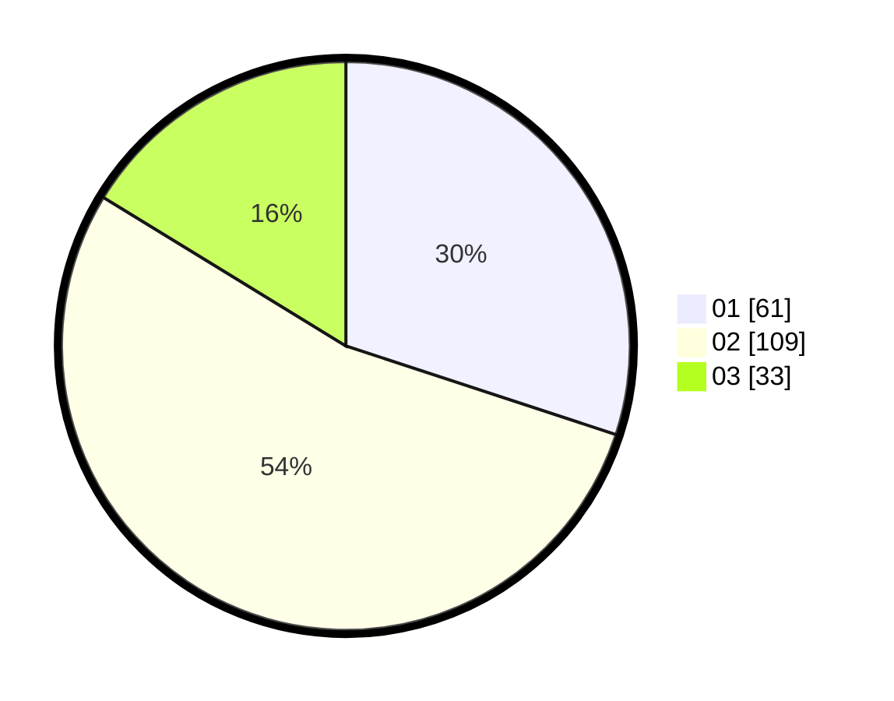

# Hasil

Hasil perolehan suara paslon dapat dilihat pada file paslon-01.txt, paslon-02.txt, dan paslon-03.txt.

Jika tidak ada, artinya data tersebut belum ada pada SIREKAP.

## Perolehan Suara

 * Paslon 01: **61**.
 * Paslon 02: **109**.
 * Paslon 03: **33**.

## Foto C Plano

https://sirekap-obj-formc.kpu.go.id/1fbe/pemilu/ppwp/31/75/09/10/01/3175091001048-20240214-201446--2a0badd0-6e69-44e9-9b15-0742fdc1d954.jpg

https://sirekap-obj-formc.kpu.go.id/1fbe/pemilu/ppwp/31/75/09/10/01/3175091001048-20240214-201646--48280936-4a6a-4f6d-b415-ce6cb9476a3a.jpg

https://sirekap-obj-formc.kpu.go.id/1fbe/pemilu/ppwp/31/75/09/10/01/3175091001048-20240214-201752--935c4ad3-ffc5-44ae-aca8-36cc7a136703.jpg

## DATA PEMILIH TETAP

Jumlah pemilih dalam DPT: **256**.
 * L: **116**.
 * P: **140**.

## DATA PENGGUNA HAK PILIH

Jumlah pengguna hak pilih dalam DPT: **206**.
 * L: **91**.
 * P: **115**.

Jumlah pengguna hak pilih dalam DPTb: **1**.
 * L: **1**.
 * P: **0**.

Jumlah pengguna hak pilih dalam DPK: **0**.
 * L: **0**.
 * P: **0**.

Jumlah pengguna hak pilih: **207**.
 * L: **92**.
 * P: **115**.

## JUMLAH SUARA SAH DAN TIDAK SAH

JUMLAH SELURUH SUARA SAH: **203**.

JUMLAH SUARA TIDAK SAH: **4**.

JUMLAH SELURUH SUARA SAH DAN SUARA TIDAK SAH: **207**.
