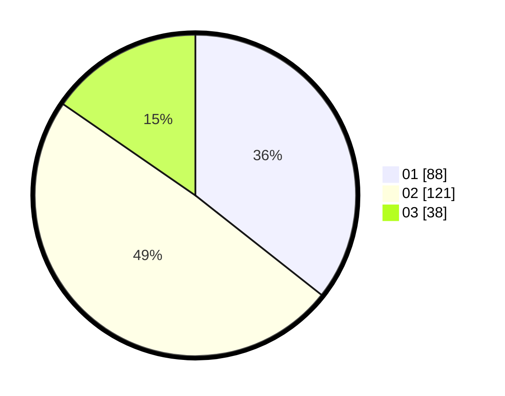

# Hasil

Hasil perolehan suara paslon dapat dilihat pada file paslon-01.txt, paslon-02.txt, dan paslon-03.txt.

Jika tidak ada, artinya data tersebut belum ada pada SIREKAP.

## Perolehan Suara

 * Paslon 01: **88**.
 * Paslon 02: **121**.
 * Paslon 03: **38**.

## Foto C Plano

https://sirekap-obj-formc.kpu.go.id/67a0/pemilu/ppwp/31/75/09/10/01/3175091001049-20240215-181018--252ab357-a7e6-4432-b09e-ab92a2179591.jpg

https://sirekap-obj-formc.kpu.go.id/67a0/pemilu/ppwp/31/75/09/10/01/3175091001049-20240214-212808--a7c71d5c-2ccd-4464-81fb-42b9211d12d5.jpg

https://sirekap-obj-formc.kpu.go.id/67a0/pemilu/ppwp/31/75/09/10/01/3175091001049-20240214-212924--99bb5046-e38a-4db0-81a6-edfe97c55f79.jpg

## DATA PEMILIH TETAP

Jumlah pemilih dalam DPT: **298**.
 * L: **152**.
 * P: **146**.

## DATA PENGGUNA HAK PILIH

Jumlah pengguna hak pilih dalam DPT: **246**.
 * L: **117**.
 * P: **129**.

Jumlah pengguna hak pilih dalam DPTb: **0**.
 * L: **0**.
 * P: **0**.

Jumlah pengguna hak pilih dalam DPK: **4**.
 * L: **1**.
 * P: **3**.

Jumlah pengguna hak pilih: **250**.
 * L: **118**.
 * P: **132**.

## JUMLAH SUARA SAH DAN TIDAK SAH

JUMLAH SELURUH SUARA SAH: **247**.

JUMLAH SUARA TIDAK SAH: **3**.

JUMLAH SELURUH SUARA SAH DAN SUARA TIDAK SAH: **250**.
