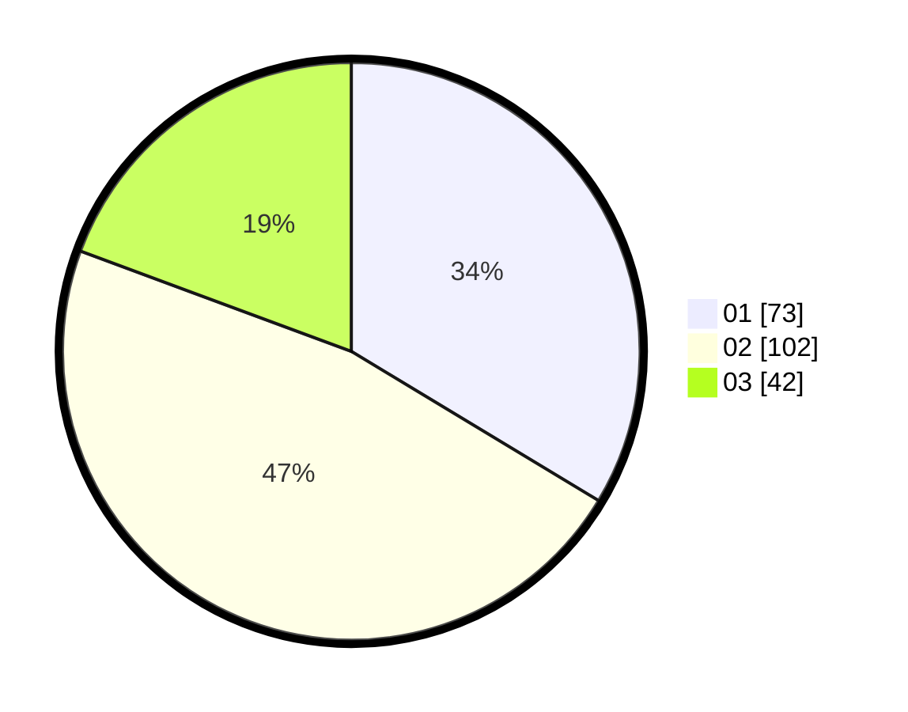

# Hasil

Hasil perolehan suara paslon dapat dilihat pada file paslon-01.txt, paslon-02.txt, dan paslon-03.txt.

Jika tidak ada, artinya data tersebut belum ada pada SIREKAP.

## Perolehan Suara

 * Paslon 01: **73**.
 * Paslon 02: **102**.
 * Paslon 03: **42**.

## Foto C Plano

https://sirekap-obj-formc.kpu.go.id/70db/pemilu/ppwp/31/75/09/10/01/3175091001052-20240219-164059--296a25ed-07e6-45fd-b10b-712af67e221e.jpg

https://sirekap-obj-formc.kpu.go.id/70db/pemilu/ppwp/31/75/09/10/01/3175091001052-20240219-164100--0ebba04c-cf02-48da-9d24-9202b85e14a5.jpg

https://sirekap-obj-formc.kpu.go.id/70db/pemilu/ppwp/31/75/09/10/01/3175091001052-20240216-174150--80ead921-1ad2-4ccd-ac1e-6a66a68932f1.jpg

## DATA PEMILIH TETAP

Jumlah pemilih dalam DPT: **266**.
 * L: **134**.
 * P: **132**.

## DATA PENGGUNA HAK PILIH

Jumlah pengguna hak pilih dalam DPT: **217**.
 * L: **101**.
 * P: **116**.

Jumlah pengguna hak pilih dalam DPTb: **0**.
 * L: **0**.
 * P: **0**.

Jumlah pengguna hak pilih dalam DPK: **4**.
 * L: **3**.
 * P: **1**.

Jumlah pengguna hak pilih: **221**.
 * L: **104**.
 * P: **117**.

## JUMLAH SUARA SAH DAN TIDAK SAH

JUMLAH SELURUH SUARA SAH: **217**.

JUMLAH SUARA TIDAK SAH: **4**.

JUMLAH SELURUH SUARA SAH DAN SUARA TIDAK SAH: **221**.
