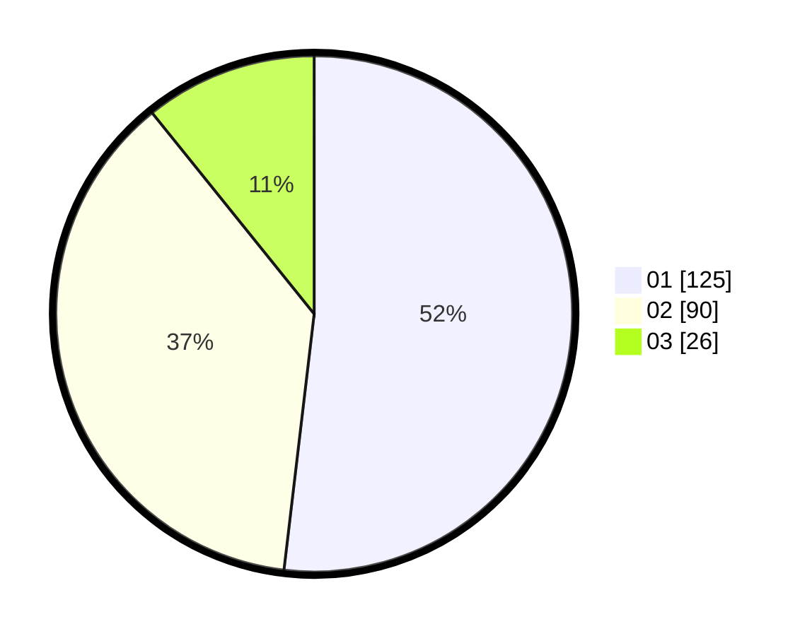

# Hasil

Hasil perolehan suara paslon dapat dilihat pada file paslon-01.txt, paslon-02.txt, dan paslon-03.txt.

Jika tidak ada, artinya data tersebut belum ada pada SIREKAP.

## Perolehan Suara

 * Paslon 01: **125**.
 * Paslon 02: **90**.
 * Paslon 03: **26**.

## Foto C Plano

https://sirekap-obj-formc.kpu.go.id/5f9c/pemilu/ppwp/31/75/09/10/01/3175091001054-20240215-205747--1e2790ed-7ea4-4602-9dbf-f6441f14f9c1.jpg

https://sirekap-obj-formc.kpu.go.id/5f9c/pemilu/ppwp/31/75/09/10/01/3175091001054-20240215-205753--fc6a8f80-60b1-4cfa-b158-4bb40d49eed3.jpg

https://sirekap-obj-formc.kpu.go.id/5f9c/pemilu/ppwp/31/75/09/10/01/3175091001054-20240215-205748--47a548e3-44dc-46aa-b01a-61caf3a3a46b.jpg

## DATA PEMILIH TETAP

Jumlah pemilih dalam DPT: **284**.
 * L: **137**.
 * P: **147**.

## DATA PENGGUNA HAK PILIH

Jumlah pengguna hak pilih dalam DPT: **242**.
 * L: **112**.
 * P: **130**.

Jumlah pengguna hak pilih dalam DPTb: **0**.
 * L: **0**.
 * P: **0**.

Jumlah pengguna hak pilih dalam DPK: **2**.
 * L: **2**.
 * P: **0**.

Jumlah pengguna hak pilih: **244**.
 * L: **114**.
 * P: **130**.

## JUMLAH SUARA SAH DAN TIDAK SAH

JUMLAH SELURUH SUARA SAH: **241**.

JUMLAH SUARA TIDAK SAH: **3**.

JUMLAH SELURUH SUARA SAH DAN SUARA TIDAK SAH: **244**.
