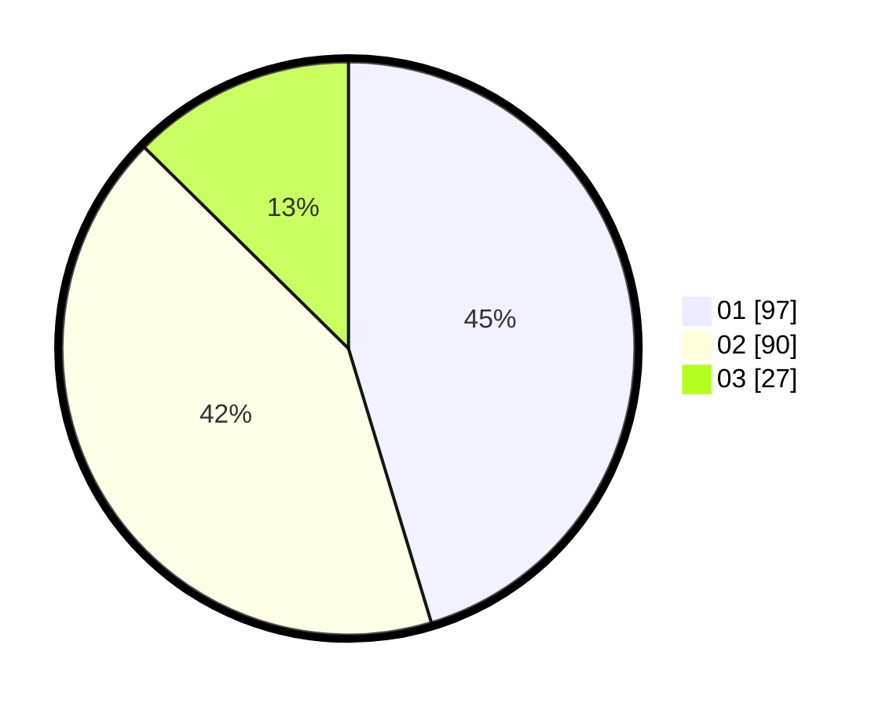

# Hasil

Hasil perolehan suara paslon dapat dilihat pada file paslon-01.txt, paslon-02.txt, dan paslon-03.txt.

Jika tidak ada, artinya data tersebut belum ada pada SIREKAP.

## Perolehan Suara

 * Paslon 01: **97**.
 * Paslon 02: **90**.
 * Paslon 03: **27**.

## Foto C Plano

https://sirekap-obj-formc.kpu.go.id/819a/pemilu/ppwp/31/75/09/10/01/3175091001055-20240216-000111--2d260253-2e54-4788-9d81-a5a83e5533a8.jpg

https://sirekap-obj-formc.kpu.go.id/819a/pemilu/ppwp/31/75/09/10/01/3175091001055-20240216-000114--163301e2-0ad2-4dca-aac7-76bca9904659.jpg

https://sirekap-obj-formc.kpu.go.id/819a/pemilu/ppwp/31/75/09/10/01/3175091001055-20240216-000112--e890d416-6a6d-4d81-90ae-343dcb426d07.jpg

## DATA PEMILIH TETAP

Jumlah pemilih dalam DPT: **265**.
 * L: **128**.
 * P: **137**.

## DATA PENGGUNA HAK PILIH

Jumlah pengguna hak pilih dalam DPT: **219**.
 * L: **105**.
 * P: **114**.

Jumlah pengguna hak pilih dalam DPTb: **0**.
 * L: **0**.
 * P: **0**.

Jumlah pengguna hak pilih dalam DPK: **0**.
 * L: **0**.
 * P: **0**.

Jumlah pengguna hak pilih: **219**.
 * L: **105**.
 * P: **114**.

## JUMLAH SUARA SAH DAN TIDAK SAH

JUMLAH SELURUH SUARA SAH: **214**.

JUMLAH SUARA TIDAK SAH: **5**.

JUMLAH SELURUH SUARA SAH DAN SUARA TIDAK SAH: **219**.
