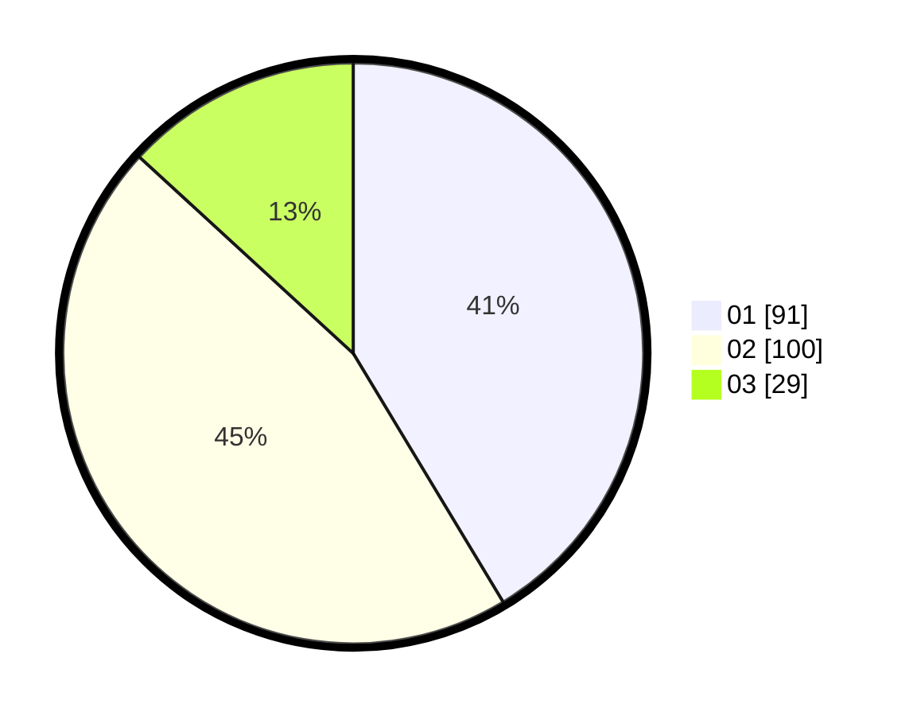

# Hasil

Hasil perolehan suara paslon dapat dilihat pada file paslon-01.txt, paslon-02.txt, dan paslon-03.txt.

Jika tidak ada, artinya data tersebut belum ada pada SIREKAP.

## Perolehan Suara

 * Paslon 01: **91**.
 * Paslon 02: **100**.
 * Paslon 03: **29**.

## Foto C Plano

https://sirekap-obj-formc.kpu.go.id/b22e/pemilu/ppwp/31/75/09/10/01/3175091001056-20240214-194942--bdde4f15-3088-45a9-99c2-21ecd52d5019.jpg

https://sirekap-obj-formc.kpu.go.id/b22e/pemilu/ppwp/31/75/09/10/01/3175091001056-20240214-195000--2a9bde65-ddeb-4bb8-a7d7-d1b7c2251c7a.jpg

https://sirekap-obj-formc.kpu.go.id/b22e/pemilu/ppwp/31/75/09/10/01/3175091001056-20240214-195013--9aeff238-6f44-4d7d-99f1-9738abed2670.jpg

## DATA PEMILIH TETAP

Jumlah pemilih dalam DPT: **222**.
 * L: **106**.
 * P: **116**.

## DATA PENGGUNA HAK PILIH

Jumlah pengguna hak pilih dalam DPT: **220**.
 * L: **105**.
 * P: **115**.

Jumlah pengguna hak pilih dalam DPTb: **2**.
 * L: **1**.
 * P: **1**.

Jumlah pengguna hak pilih dalam DPK: **0**.
 * L: **0**.
 * P: **0**.

Jumlah pengguna hak pilih: **222**.
 * L: **106**.
 * P: **116**.

## JUMLAH SUARA SAH DAN TIDAK SAH

JUMLAH SELURUH SUARA SAH: **220**.

JUMLAH SUARA TIDAK SAH: **2**.

JUMLAH SELURUH SUARA SAH DAN SUARA TIDAK SAH: **222**.
