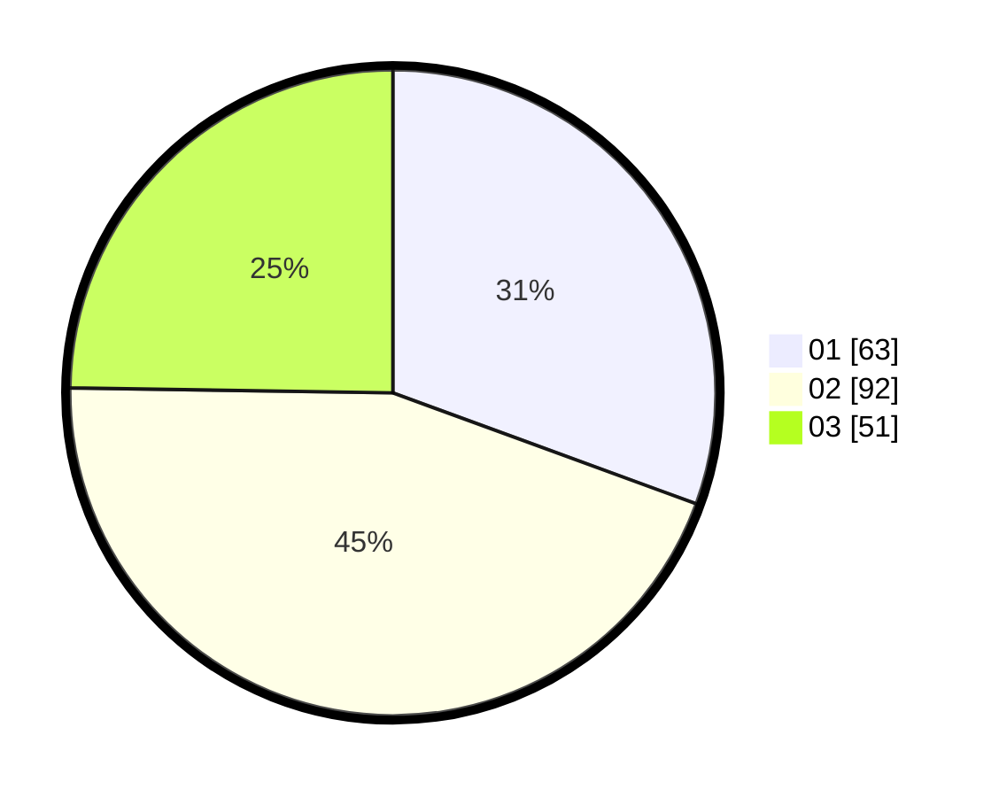

# Hasil

Hasil perolehan suara paslon dapat dilihat pada file paslon-01.txt, paslon-02.txt, dan paslon-03.txt.

Jika tidak ada, artinya data tersebut belum ada pada SIREKAP.

## Perolehan Suara

 * Paslon 01: **63**.
 * Paslon 02: **92**.
 * Paslon 03: **51**.

## Foto C Plano

https://sirekap-obj-formc.kpu.go.id/4773/pemilu/ppwp/31/75/09/10/01/3175091001057-20240216-013635--cafce784-8aa6-483c-90b5-37e2ddb34ac7.jpg

https://sirekap-obj-formc.kpu.go.id/4773/pemilu/ppwp/31/75/09/10/01/3175091001057-20240216-013640--f01b60f3-a4f8-4267-b4ca-7f591e47a0a5.jpg

https://sirekap-obj-formc.kpu.go.id/4773/pemilu/ppwp/31/75/09/10/01/3175091001057-20240216-013636--ef3a3045-2744-4e6a-a808-5bc4c2606e1b.jpg

## DATA PEMILIH TETAP

Jumlah pemilih dalam DPT: **291**.
 * L: **140**.
 * P: **151**.

## DATA PENGGUNA HAK PILIH

Jumlah pengguna hak pilih dalam DPT: **208**.
 * L: **96**.
 * P: **112**.

Jumlah pengguna hak pilih dalam DPTb: **1**.
 * L: **0**.
 * P: **1**.

Jumlah pengguna hak pilih dalam DPK: **1**.
 * L: **0**.
 * P: **1**.

Jumlah pengguna hak pilih: **210**.
 * L: **97**.
 * P: **113**.

## JUMLAH SUARA SAH DAN TIDAK SAH

JUMLAH SELURUH SUARA SAH: **206**.

JUMLAH SUARA TIDAK SAH: **4**.

JUMLAH SELURUH SUARA SAH DAN SUARA TIDAK SAH: **210**.
