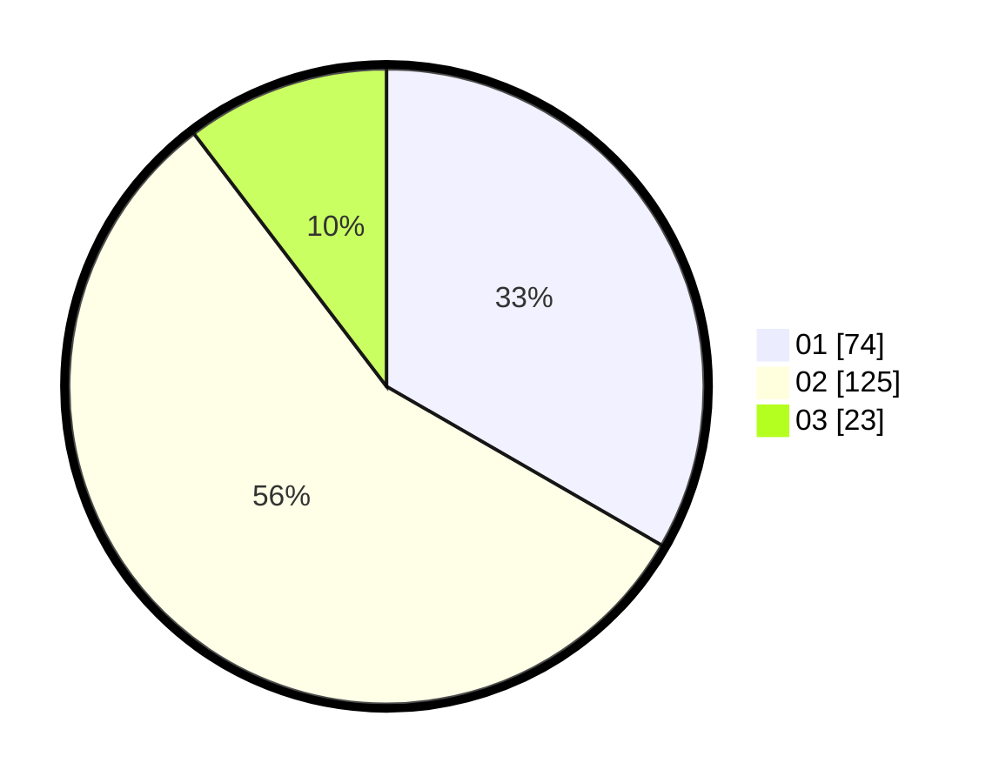

# Hasil

Hasil perolehan suara paslon dapat dilihat pada file paslon-01.txt, paslon-02.txt, dan paslon-03.txt.

Jika tidak ada, artinya data tersebut belum ada pada SIREKAP.

## Perolehan Suara

 * Paslon 01: **74**.
 * Paslon 02: **125**.
 * Paslon 03: **23**.

## Foto C Plano

https://sirekap-obj-formc.kpu.go.id/013b/pemilu/ppwp/31/75/09/10/01/3175091001060-20240216-190511--e239e725-e030-4f72-a015-7a258b2af8fd.jpg

https://sirekap-obj-formc.kpu.go.id/013b/pemilu/ppwp/31/75/09/10/01/3175091001060-20240216-190647--412babae-e041-4552-9837-23a357c2e882.jpg

https://sirekap-obj-formc.kpu.go.id/013b/pemilu/ppwp/31/75/09/10/01/3175091001060-20240216-191630--468fcebf-8406-4ea2-b172-82e77e7d5bde.jpg

## DATA PEMILIH TETAP

Jumlah pemilih dalam DPT: **275**.
 * L: **128**.
 * P: **147**.

## DATA PENGGUNA HAK PILIH

Jumlah pengguna hak pilih dalam DPT: **219**.
 * L: **98**.
 * P: **121**.

Jumlah pengguna hak pilih dalam DPTb: **0**.
 * L: **0**.
 * P: **0**.

Jumlah pengguna hak pilih dalam DPK: **4**.
 * L: **3**.
 * P: **1**.

Jumlah pengguna hak pilih: **223**.
 * L: **101**.
 * P: **122**.

## JUMLAH SUARA SAH DAN TIDAK SAH

JUMLAH SELURUH SUARA SAH: **222**.

JUMLAH SUARA TIDAK SAH: **1**.

JUMLAH SELURUH SUARA SAH DAN SUARA TIDAK SAH: **223**.
