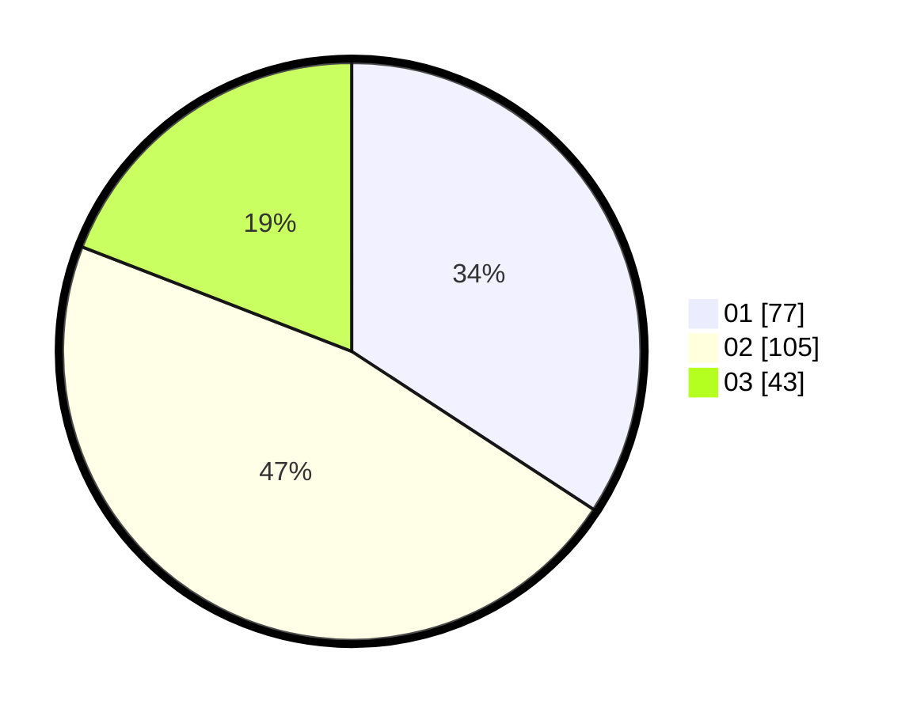

# Hasil

Hasil perolehan suara paslon dapat dilihat pada file paslon-01.txt, paslon-02.txt, dan paslon-03.txt.

Jika tidak ada, artinya data tersebut belum ada pada SIREKAP.

## Perolehan Suara

 * Paslon 01: **77**.
 * Paslon 02: **105**.
 * Paslon 03: **43**.

## Foto C Plano

https://sirekap-obj-formc.kpu.go.id/5d5e/pemilu/ppwp/31/75/09/10/01/3175091001061-20240216-083327--998d21ec-8a29-4a0c-902a-a660074dfad8.jpg

https://sirekap-obj-formc.kpu.go.id/5d5e/pemilu/ppwp/31/75/09/10/01/3175091001061-20240216-083830--3b204c88-7b19-4932-a939-4a12c4304d8c.jpg

https://sirekap-obj-formc.kpu.go.id/5d5e/pemilu/ppwp/31/75/09/10/01/3175091001061-20240216-084340--18eacfc1-6b3a-429b-81b3-49eeccdf1cf7.jpg

## DATA PEMILIH TETAP

Jumlah pemilih dalam DPT: **276**.
 * L: **130**.
 * P: **146**.

## DATA PENGGUNA HAK PILIH

Jumlah pengguna hak pilih dalam DPT: **225**.
 * L: **101**.
 * P: **124**.

Jumlah pengguna hak pilih dalam DPTb: **0**.
 * L: **0**.
 * P: **0**.

Jumlah pengguna hak pilih dalam DPK: **4**.
 * L: **2**.
 * P: **2**.

Jumlah pengguna hak pilih: **229**.
 * L: **103**.
 * P: **126**.

## JUMLAH SUARA SAH DAN TIDAK SAH

JUMLAH SELURUH SUARA SAH: **225**.

JUMLAH SUARA TIDAK SAH: **4**.

JUMLAH SELURUH SUARA SAH DAN SUARA TIDAK SAH: **229**.
