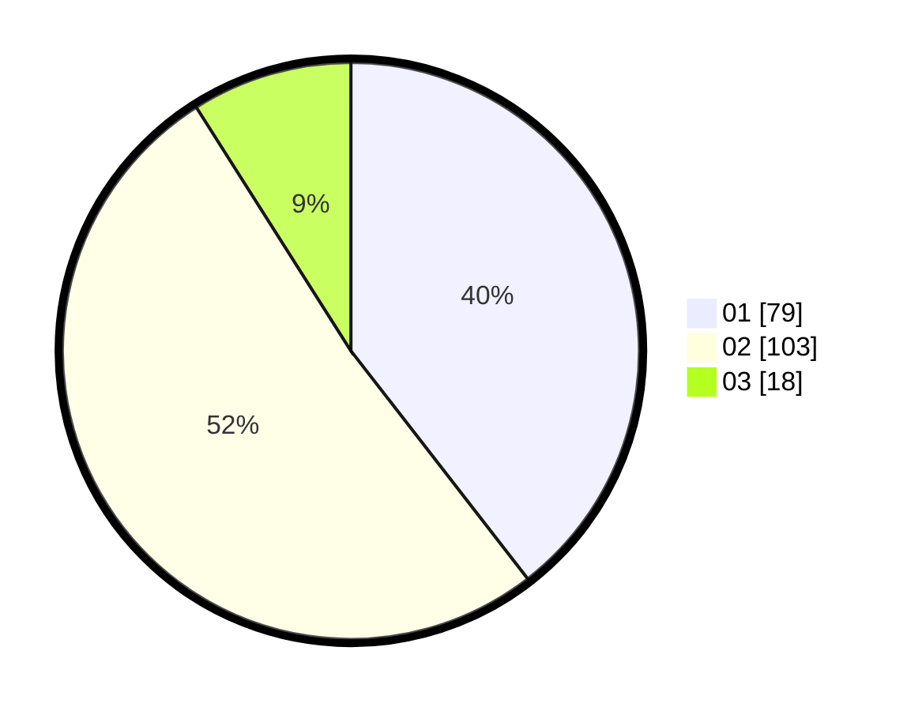

# Hasil

Hasil perolehan suara paslon dapat dilihat pada file paslon-01.txt, paslon-02.txt, dan paslon-03.txt.

Jika tidak ada, artinya data tersebut belum ada pada SIREKAP.

## Perolehan Suara

 * Paslon 01: **79**.
 * Paslon 02: **103**.
 * Paslon 03: **18**.

## Foto C Plano

https://sirekap-obj-formc.kpu.go.id/d8f4/pemilu/ppwp/31/75/09/10/01/3175091001062-20240215-021405--07407b34-7052-4aaf-9c30-812887b7215b.jpg

https://sirekap-obj-formc.kpu.go.id/d8f4/pemilu/ppwp/31/75/09/10/01/3175091001062-20240215-021715--e012e798-8463-4e31-8653-18da59f5652f.jpg

https://sirekap-obj-formc.kpu.go.id/d8f4/pemilu/ppwp/31/75/09/10/01/3175091001062-20240218-075719--e4e1f2a0-876e-44a3-9263-85e18c01c4ed.jpg

## DATA PEMILIH TETAP

Jumlah pemilih dalam DPT: **274**.
 * L: **132**.
 * P: **142**.

## DATA PENGGUNA HAK PILIH

Jumlah pengguna hak pilih dalam DPT: **205**.
 * L: **89**.
 * P: **116**.

Jumlah pengguna hak pilih dalam DPTb: **0**.
 * L: **0**.
 * P: **0**.

Jumlah pengguna hak pilih dalam DPK: **0**.
 * L: **0**.
 * P: **0**.

Jumlah pengguna hak pilih: **205**.
 * L: **89**.
 * P: **116**.

## JUMLAH SUARA SAH DAN TIDAK SAH

JUMLAH SELURUH SUARA SAH: **200**.

JUMLAH SUARA TIDAK SAH: **5**.

JUMLAH SELURUH SUARA SAH DAN SUARA TIDAK SAH: **205**.
