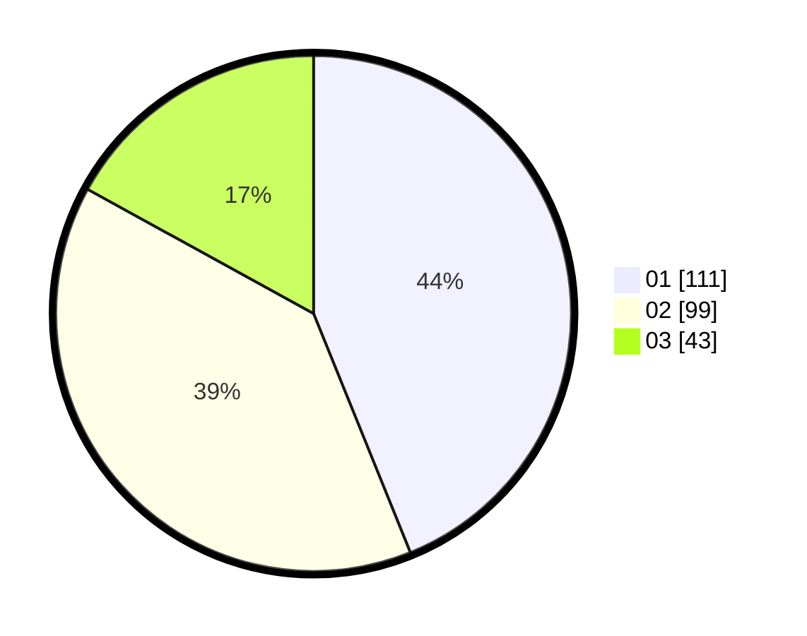

# Hasil

Hasil perolehan suara paslon dapat dilihat pada file paslon-01.txt, paslon-02.txt, dan paslon-03.txt.

Jika tidak ada, artinya data tersebut belum ada pada SIREKAP.

## Perolehan Suara

 * Paslon 01: **111**.
 * Paslon 02: **99**.
 * Paslon 03: **43**.

## Foto C Plano

https://sirekap-obj-formc.kpu.go.id/3b9d/pemilu/ppwp/31/75/09/10/01/3175091001068-20240214-224843--4392ba48-1b39-4851-9726-a19bd8394888.jpg

https://sirekap-obj-formc.kpu.go.id/3b9d/pemilu/ppwp/31/75/09/10/01/3175091001068-20240214-224941--385246a1-eef4-4546-9b08-5d038dccb883.jpg

https://sirekap-obj-formc.kpu.go.id/3b9d/pemilu/ppwp/31/75/09/10/01/3175091001068-20240214-225051--36a93cbf-97eb-4141-8e88-1b2bc278f23d.jpg

## DATA PEMILIH TETAP

Jumlah pemilih dalam DPT: **272**.
 * L: **143**.
 * P: **129**.

## DATA PENGGUNA HAK PILIH

Jumlah pengguna hak pilih dalam DPT: **251**.
 * L: **129**.
 * P: **122**.

Jumlah pengguna hak pilih dalam DPTb: **0**.
 * L: **0**.
 * P: **0**.

Jumlah pengguna hak pilih dalam DPK: **4**.
 * L: **2**.
 * P: **2**.

Jumlah pengguna hak pilih: **255**.
 * L: **131**.
 * P: **124**.

## JUMLAH SUARA SAH DAN TIDAK SAH

JUMLAH SELURUH SUARA SAH: **253**.

JUMLAH SUARA TIDAK SAH: **2**.

JUMLAH SELURUH SUARA SAH DAN SUARA TIDAK SAH: **255**.
