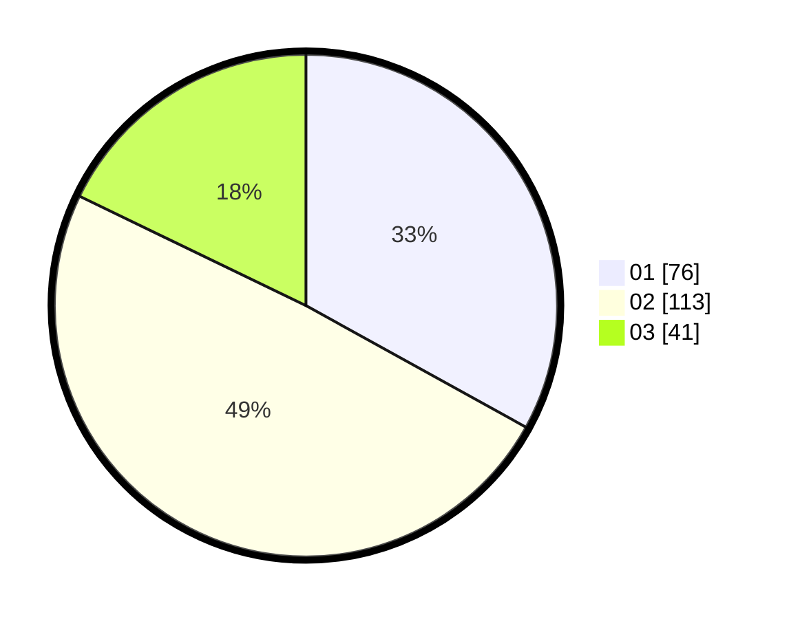

# Hasil

Hasil perolehan suara paslon dapat dilihat pada file paslon-01.txt, paslon-02.txt, dan paslon-03.txt.

Jika tidak ada, artinya data tersebut belum ada pada SIREKAP.

## Perolehan Suara

 * Paslon 01: **76**.
 * Paslon 02: **113**.
 * Paslon 03: **41**.

## Foto C Plano

https://sirekap-obj-formc.kpu.go.id/fc2c/pemilu/ppwp/31/75/09/10/01/3175091001069-20240214-194318--8f46519f-76fd-424a-8d0f-73b25cef7fd4.jpg

https://sirekap-obj-formc.kpu.go.id/fc2c/pemilu/ppwp/31/75/09/10/01/3175091001069-20240214-201041--8c82a150-b1f0-44ae-89ac-6c4e91f9b2e0.jpg

https://sirekap-obj-formc.kpu.go.id/fc2c/pemilu/ppwp/31/75/09/10/01/3175091001069-20240214-201231--0c2aae3e-65fa-41d9-836a-df98c9ad74e2.jpg

## DATA PEMILIH TETAP

Jumlah pemilih dalam DPT: **281**.
 * L: **135**.
 * P: **146**.

## DATA PENGGUNA HAK PILIH

Jumlah pengguna hak pilih dalam DPT: **233**.
 * L: **108**.
 * P: **125**.

Jumlah pengguna hak pilih dalam DPTb: **0**.
 * L: **0**.
 * P: **0**.

Jumlah pengguna hak pilih dalam DPK: **0**.
 * L: **0**.
 * P: **0**.

Jumlah pengguna hak pilih: **233**.
 * L: **108**.
 * P: **125**.

## JUMLAH SUARA SAH DAN TIDAK SAH

JUMLAH SELURUH SUARA SAH: **230**.

JUMLAH SUARA TIDAK SAH: **3**.

JUMLAH SELURUH SUARA SAH DAN SUARA TIDAK SAH: **233**.
