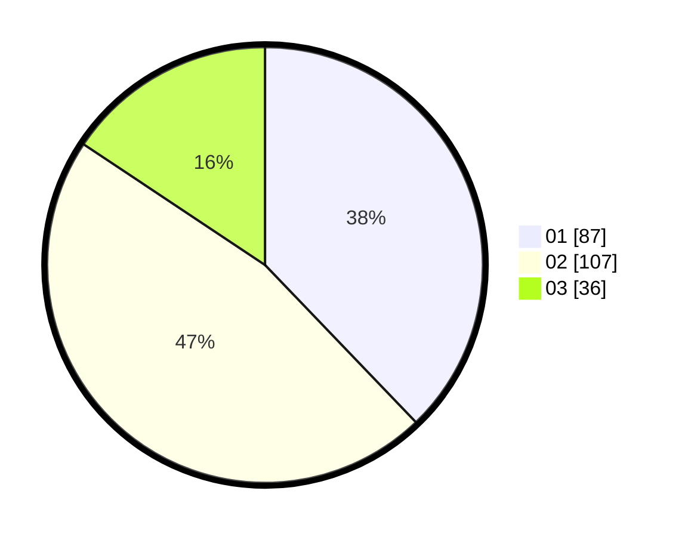

# Hasil

Hasil perolehan suara paslon dapat dilihat pada file paslon-01.txt, paslon-02.txt, dan paslon-03.txt.

Jika tidak ada, artinya data tersebut belum ada pada SIREKAP.

## Perolehan Suara

 * Paslon 01: **87**.
 * Paslon 02: **107**.
 * Paslon 03: **36**.

## Foto C Plano

https://sirekap-obj-formc.kpu.go.id/a278/pemilu/ppwp/31/75/09/10/01/3175091001070-20240214-215900--053a983d-433f-4d90-8bed-4cf00c1c5ddc.jpg

https://sirekap-obj-formc.kpu.go.id/a278/pemilu/ppwp/31/75/09/10/01/3175091001070-20240214-220050--39036b13-503b-4c6e-9ae2-f5361ac0370a.jpg

https://sirekap-obj-formc.kpu.go.id/a278/pemilu/ppwp/31/75/09/10/01/3175091001070-20240215-204203--29913718-b730-4a6a-ba1f-e3faa8d78bad.jpg

## DATA PEMILIH TETAP

Jumlah pemilih dalam DPT: **276**.
 * L: **127**.
 * P: **149**.

## DATA PENGGUNA HAK PILIH

Jumlah pengguna hak pilih dalam DPT: **231**.
 * L: **105**.
 * P: **126**.

Jumlah pengguna hak pilih dalam DPTb: **0**.
 * L: **0**.
 * P: **0**.

Jumlah pengguna hak pilih dalam DPK: **0**.
 * L: **0**.
 * P: **0**.

Jumlah pengguna hak pilih: **231**.
 * L: **105**.
 * P: **126**.

## JUMLAH SUARA SAH DAN TIDAK SAH

JUMLAH SELURUH SUARA SAH: **230**.

JUMLAH SUARA TIDAK SAH: **1**.

JUMLAH SELURUH SUARA SAH DAN SUARA TIDAK SAH: **231**.
