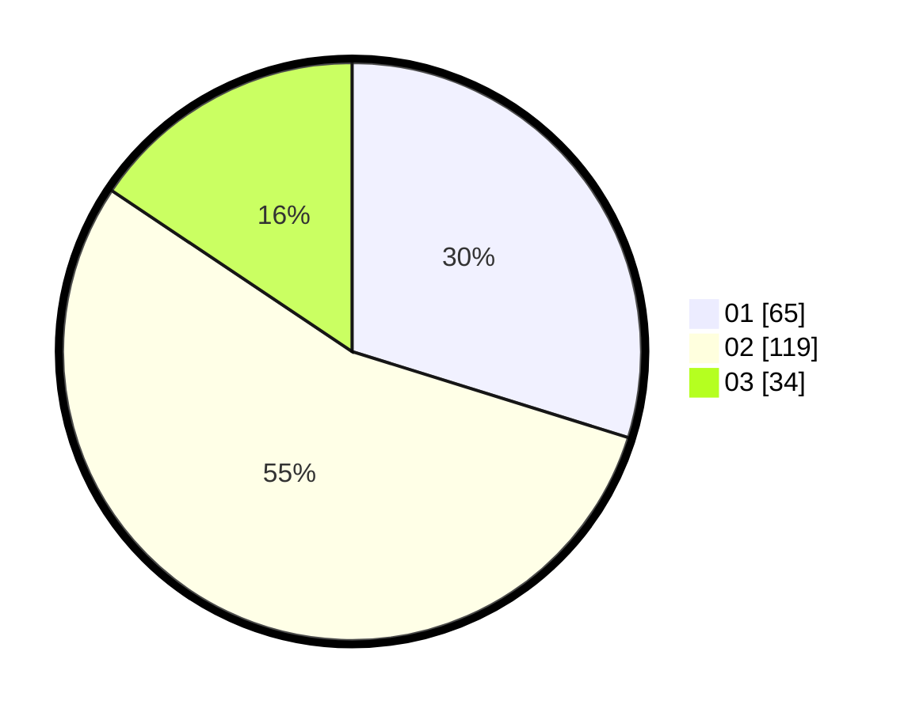

# Hasil

Hasil perolehan suara paslon dapat dilihat pada file paslon-01.txt, paslon-02.txt, dan paslon-03.txt.

Jika tidak ada, artinya data tersebut belum ada pada SIREKAP.

## Perolehan Suara

 * Paslon 01: **65**.
 * Paslon 02: **119**.
 * Paslon 03: **34**.

## Foto C Plano

https://sirekap-obj-formc.kpu.go.id/e1c8/pemilu/ppwp/31/75/09/10/01/3175091001077-20240216-205344--4d1f0195-3c6f-4cc5-baa9-01901b2ffb13.jpg

https://sirekap-obj-formc.kpu.go.id/e1c8/pemilu/ppwp/31/75/09/10/01/3175091001077-20240216-205500--ffdffab6-f5fc-41b7-a70c-1e30cdbd3760.jpg

https://sirekap-obj-formc.kpu.go.id/e1c8/pemilu/ppwp/31/75/09/10/01/3175091001077-20240216-233111--4a85d410-42bc-452e-a115-b14bca9d2671.jpg

## DATA PEMILIH TETAP

Jumlah pemilih dalam DPT: **219**.
 * L: **92**.
 * P: **127**.

## DATA PENGGUNA HAK PILIH

Jumlah pengguna hak pilih dalam DPT: **218**.
 * L: **91**.
 * P: **127**.

Jumlah pengguna hak pilih dalam DPTb: **0**.
 * L: **0**.
 * P: **0**.

Jumlah pengguna hak pilih dalam DPK: **1**.
 * L: **0**.
 * P: **1**.

Jumlah pengguna hak pilih: **219**.
 * L: **91**.
 * P: **128**.

## JUMLAH SUARA SAH DAN TIDAK SAH

JUMLAH SELURUH SUARA SAH: **218**.

JUMLAH SUARA TIDAK SAH: **1**.

JUMLAH SELURUH SUARA SAH DAN SUARA TIDAK SAH: **219**.
