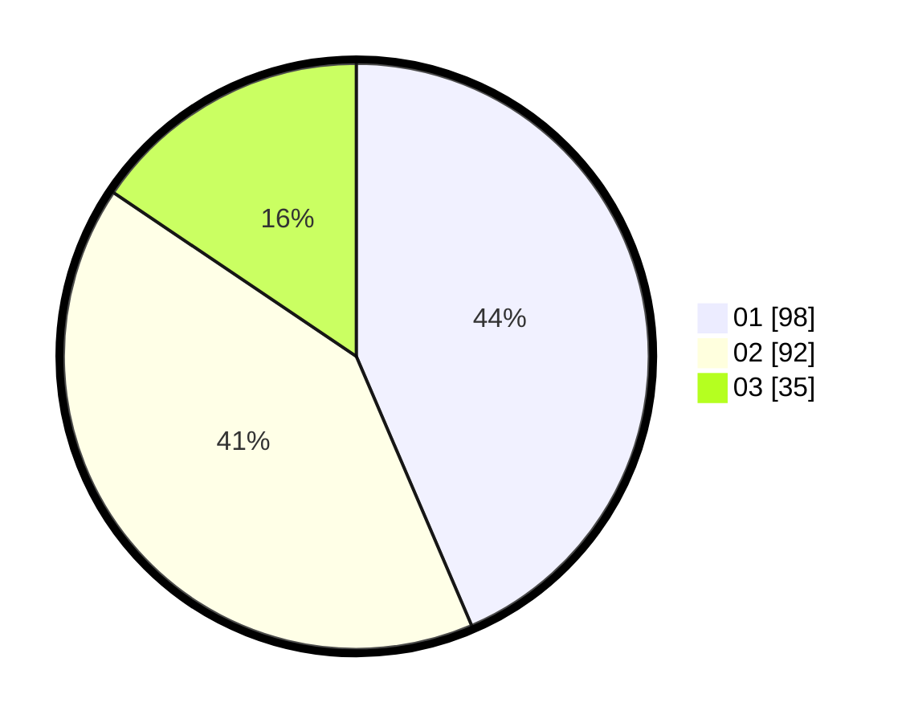

# Hasil

Hasil perolehan suara paslon dapat dilihat pada file paslon-01.txt, paslon-02.txt, dan paslon-03.txt.

Jika tidak ada, artinya data tersebut belum ada pada SIREKAP.

## Perolehan Suara

 * Paslon 01: **98**.
 * Paslon 02: **92**.
 * Paslon 03: **35**.

## Foto C Plano

https://sirekap-obj-formc.kpu.go.id/ab6d/pemilu/ppwp/31/75/09/10/01/3175091001081-20240214-211759--59f1408d-b531-49eb-8457-276745972a6e.jpg

https://sirekap-obj-formc.kpu.go.id/ab6d/pemilu/ppwp/31/75/09/10/01/3175091001081-20240214-211826--1c8245d4-9aaf-4e8b-b1a5-30dfbbc6a26a.jpg

https://sirekap-obj-formc.kpu.go.id/ab6d/pemilu/ppwp/31/75/09/10/01/3175091001081-20240214-211932--3cd580ff-081e-4d4a-ae6c-673d1bd8da60.jpg

## DATA PEMILIH TETAP

Jumlah pemilih dalam DPT: **271**.
 * L: **133**.
 * P: **138**.

## DATA PENGGUNA HAK PILIH

Jumlah pengguna hak pilih dalam DPT: **226**.
 * L: **109**.
 * P: **117**.

Jumlah pengguna hak pilih dalam DPTb: **0**.
 * L: **0**.
 * P: **0**.

Jumlah pengguna hak pilih dalam DPK: **2**.
 * L: **2**.
 * P: **0**.

Jumlah pengguna hak pilih: **228**.
 * L: **111**.
 * P: **117**.

## JUMLAH SUARA SAH DAN TIDAK SAH

JUMLAH SELURUH SUARA SAH: **225**.

JUMLAH SUARA TIDAK SAH: **3**.

JUMLAH SELURUH SUARA SAH DAN SUARA TIDAK SAH: **228**.
