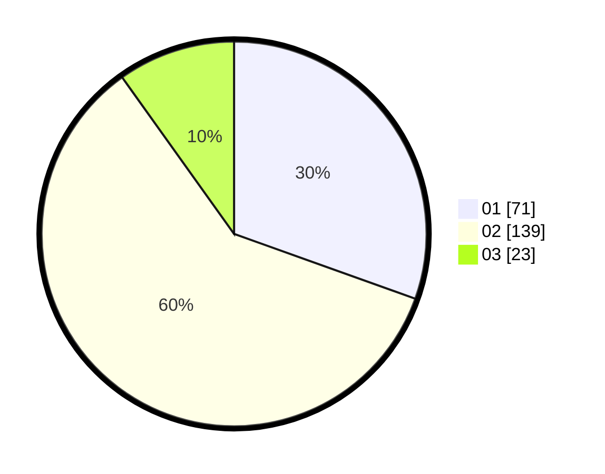

# Hasil

Hasil perolehan suara paslon dapat dilihat pada file paslon-01.txt, paslon-02.txt, dan paslon-03.txt.

Jika tidak ada, artinya data tersebut belum ada pada SIREKAP.

## Perolehan Suara

 * Paslon 01: **71**.
 * Paslon 02: **139**.
 * Paslon 03: **23**.

## Foto C Plano

https://sirekap-obj-formc.kpu.go.id/3e1c/pemilu/ppwp/31/75/09/10/01/3175091001088-20240216-140907--ac0be902-01fd-4e0f-8eb3-b8ca36e531ff.jpg

https://sirekap-obj-formc.kpu.go.id/3e1c/pemilu/ppwp/31/75/09/10/01/3175091001088-20240216-140909--58f60b50-d3dc-47c1-b6bc-d6a02908ef84.jpg

https://sirekap-obj-formc.kpu.go.id/3e1c/pemilu/ppwp/31/75/09/10/01/3175091001088-20240216-140908--add88810-30e6-4c2d-b30f-c9c3af94c353.jpg

## DATA PEMILIH TETAP

Jumlah pemilih dalam DPT: **269**.
 * L: **130**.
 * P: **139**.

## DATA PENGGUNA HAK PILIH

Jumlah pengguna hak pilih dalam DPT: **233**.
 * L: **111**.
 * P: **122**.

Jumlah pengguna hak pilih dalam DPTb: **1**.
 * L: **0**.
 * P: **1**.

Jumlah pengguna hak pilih dalam DPK: **5**.
 * L: **1**.
 * P: **4**.

Jumlah pengguna hak pilih: **239**.
 * L: **112**.
 * P: **127**.

## JUMLAH SUARA SAH DAN TIDAK SAH

JUMLAH SELURUH SUARA SAH: **233**.

JUMLAH SUARA TIDAK SAH: **6**.

JUMLAH SELURUH SUARA SAH DAN SUARA TIDAK SAH: **239**.
