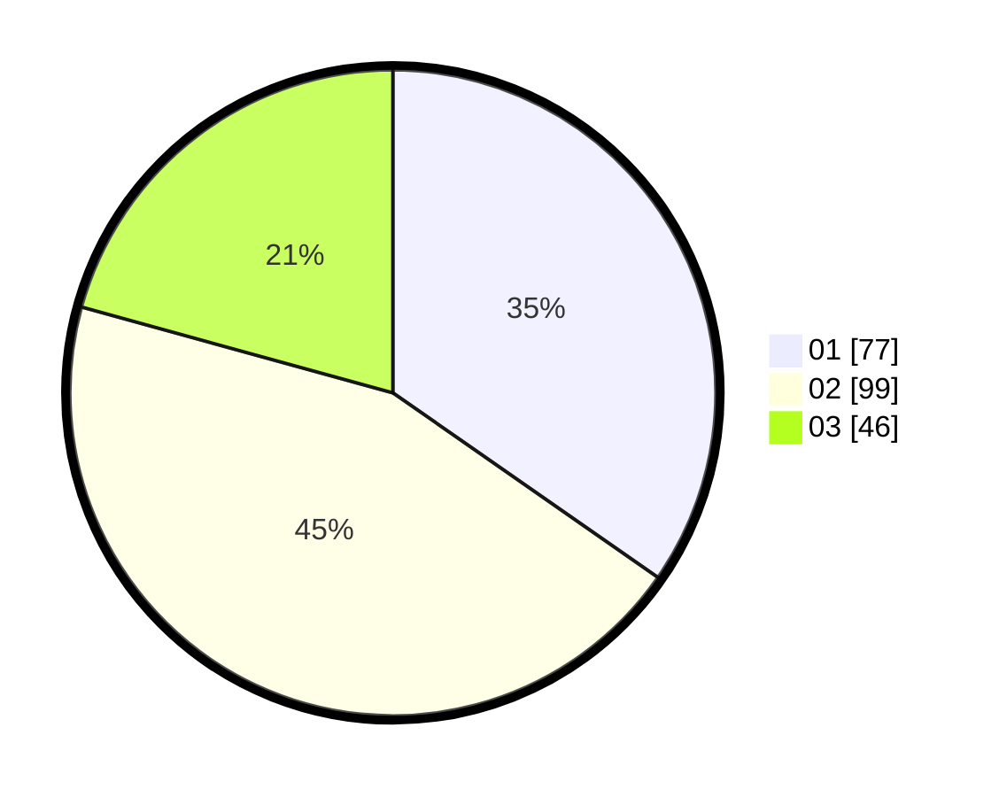

# Hasil

Hasil perolehan suara paslon dapat dilihat pada file paslon-01.txt, paslon-02.txt, dan paslon-03.txt.

Jika tidak ada, artinya data tersebut belum ada pada SIREKAP.

## Perolehan Suara

 * Paslon 01: **77**.
 * Paslon 02: **99**.
 * Paslon 03: **46**.

## Foto C Plano

https://sirekap-obj-formc.kpu.go.id/00a6/pemilu/ppwp/31/75/09/10/01/3175091001090-20240216-223930--bf20c610-3ff4-4b37-a922-b94c0d964a77.jpg

https://sirekap-obj-formc.kpu.go.id/00a6/pemilu/ppwp/31/75/09/10/01/3175091001090-20240216-223932--a66be2ba-0bc5-4e6f-92f7-46d06c482e9b.jpg

https://sirekap-obj-formc.kpu.go.id/00a6/pemilu/ppwp/31/75/09/10/01/3175091001090-20240216-223931--fd808325-967b-4301-bc15-3ddb6d0fe7ac.jpg

## DATA PEMILIH TETAP

Jumlah pemilih dalam DPT: **227**.
 * L: **110**.
 * P: **117**.

## DATA PENGGUNA HAK PILIH

Jumlah pengguna hak pilih dalam DPT: **227**.
 * L: **110**.
 * P: **117**.

Jumlah pengguna hak pilih dalam DPTb: **0**.
 * L: **0**.
 * P: **0**.

Jumlah pengguna hak pilih dalam DPK: **0**.
 * L: **0**.
 * P: **0**.

Jumlah pengguna hak pilih: **227**.
 * L: **110**.
 * P: **117**.

## JUMLAH SUARA SAH DAN TIDAK SAH

JUMLAH SELURUH SUARA SAH: **222**.

JUMLAH SUARA TIDAK SAH: **5**.

JUMLAH SELURUH SUARA SAH DAN SUARA TIDAK SAH: **227**.
