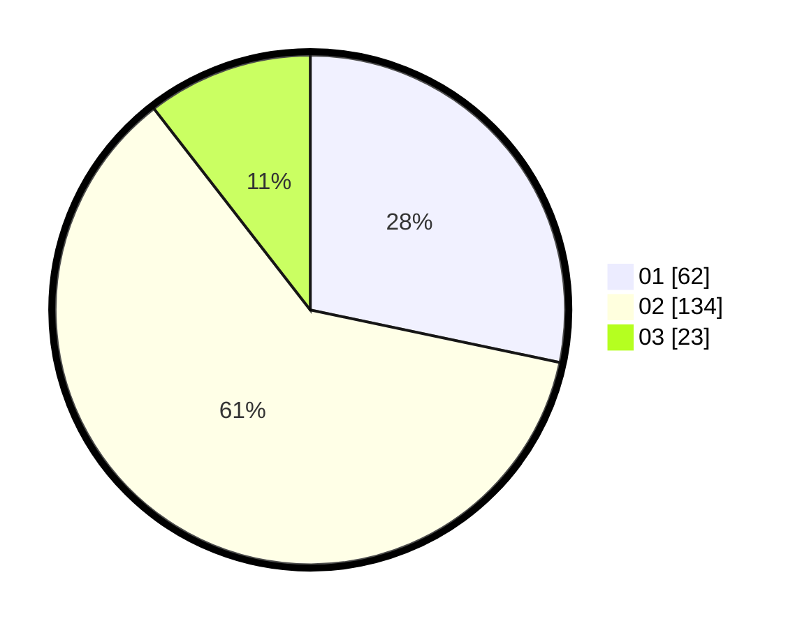

# Hasil

Hasil perolehan suara paslon dapat dilihat pada file paslon-01.txt, paslon-02.txt, dan paslon-03.txt.

Jika tidak ada, artinya data tersebut belum ada pada SIREKAP.

## Perolehan Suara

 * Paslon 01: **62**.
 * Paslon 02: **134**.
 * Paslon 03: **23**.

## Foto C Plano

https://sirekap-obj-formc.kpu.go.id/fda8/pemilu/ppwp/31/75/09/10/01/3175091001092-20240214-185349--4db0a952-832b-486b-b334-bd6e0ce8e6c8.jpg

https://sirekap-obj-formc.kpu.go.id/fda8/pemilu/ppwp/31/75/09/10/01/3175091001092-20240214-185449--046f19c4-1ff0-4fda-bc01-4c293c821813.jpg

https://sirekap-obj-formc.kpu.go.id/fda8/pemilu/ppwp/31/75/09/10/01/3175091001092-20240214-185607--e64e75b7-49bb-4013-a201-63c7d0a647f0.jpg

## DATA PEMILIH TETAP

Jumlah pemilih dalam DPT: **270**.
 * L: **139**.
 * P: **131**.

## DATA PENGGUNA HAK PILIH

Jumlah pengguna hak pilih dalam DPT: **220**.
 * L: **108**.
 * P: **112**.

Jumlah pengguna hak pilih dalam DPTb: **0**.
 * L: **0**.
 * P: **0**.

Jumlah pengguna hak pilih dalam DPK: **1**.
 * L: **0**.
 * P: **1**.

Jumlah pengguna hak pilih: **221**.
 * L: **108**.
 * P: **113**.

## JUMLAH SUARA SAH DAN TIDAK SAH

JUMLAH SELURUH SUARA SAH: **219**.

JUMLAH SUARA TIDAK SAH: **2**.

JUMLAH SELURUH SUARA SAH DAN SUARA TIDAK SAH: **221**.
