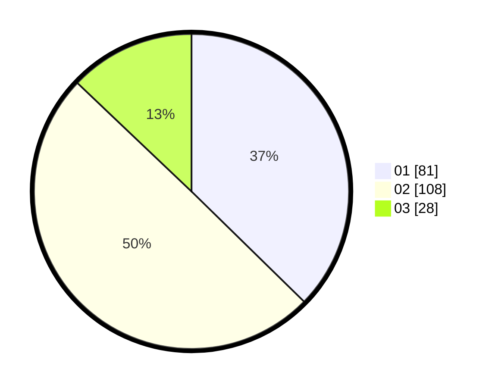

# Hasil

Hasil perolehan suara paslon dapat dilihat pada file paslon-01.txt, paslon-02.txt, dan paslon-03.txt.

Jika tidak ada, artinya data tersebut belum ada pada SIREKAP.

## Perolehan Suara

 * Paslon 01: **81**.
 * Paslon 02: **108**.
 * Paslon 03: **28**.

## Foto C Plano

https://sirekap-obj-formc.kpu.go.id/e514/pemilu/ppwp/31/75/09/10/01/3175091001095-20240214-230800--90f22d4f-f7c4-4915-838b-6ca0dca7035a.jpg

https://sirekap-obj-formc.kpu.go.id/e514/pemilu/ppwp/31/75/09/10/01/3175091001095-20240214-230809--4c38267f-f052-417e-86e9-ca27588f449f.jpg

https://sirekap-obj-formc.kpu.go.id/e514/pemilu/ppwp/31/75/09/10/01/3175091001095-20240214-230815--97672e4a-b3d0-409f-85cd-095a677093e6.jpg

## DATA PEMILIH TETAP

Jumlah pemilih dalam DPT: **278**.
 * L: **143**.
 * P: **135**.

## DATA PENGGUNA HAK PILIH

Jumlah pengguna hak pilih dalam DPT: **221**.
 * L: **106**.
 * P: **115**.

Jumlah pengguna hak pilih dalam DPTb: **2**.
 * L: **1**.
 * P: **1**.

Jumlah pengguna hak pilih dalam DPK: **0**.
 * L: **0**.
 * P: **0**.

Jumlah pengguna hak pilih: **223**.
 * L: **107**.
 * P: **116**.

## JUMLAH SUARA SAH DAN TIDAK SAH

JUMLAH SELURUH SUARA SAH: **217**.

JUMLAH SUARA TIDAK SAH: **6**.

JUMLAH SELURUH SUARA SAH DAN SUARA TIDAK SAH: **223**.
