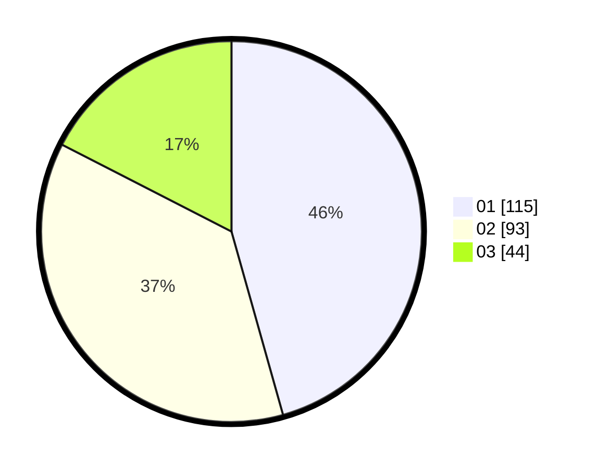

# Hasil

Hasil perolehan suara paslon dapat dilihat pada file paslon-01.txt, paslon-02.txt, dan paslon-03.txt.

Jika tidak ada, artinya data tersebut belum ada pada SIREKAP.

## Perolehan Suara

 * Paslon 01: **115**.
 * Paslon 02: **93**.
 * Paslon 03: **44**.

## Foto C Plano

https://sirekap-obj-formc.kpu.go.id/45c3/pemilu/ppwp/31/75/09/10/01/3175091001097-20240216-212154--e8aa01a3-6e39-4eb6-b30d-1890c024b2be.jpg

https://sirekap-obj-formc.kpu.go.id/45c3/pemilu/ppwp/31/75/09/10/01/3175091001097-20240218-123021--c6a24184-32b2-44f7-85ca-d309370004c3.jpg

https://sirekap-obj-formc.kpu.go.id/45c3/pemilu/ppwp/31/75/09/10/01/3175091001097-20240215-004442--eec905cc-2a90-430b-ba01-7bc43c0f5068.jpg
