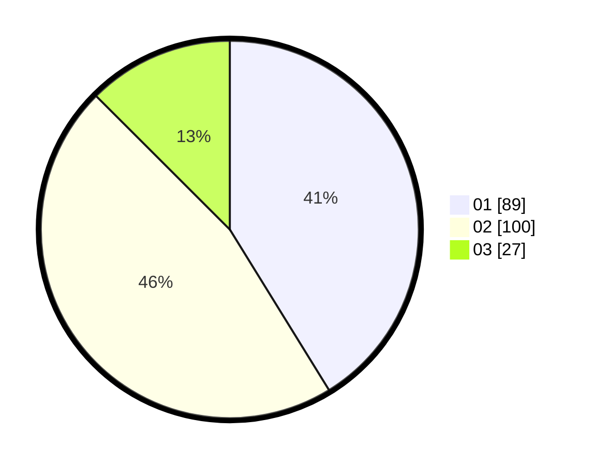

# Hasil

Hasil perolehan suara paslon dapat dilihat pada file paslon-01.txt, paslon-02.txt, dan paslon-03.txt.

Jika tidak ada, artinya data tersebut belum ada pada SIREKAP.

## Perolehan Suara

 * Paslon 01: **89**.
 * Paslon 02: **100**.
 * Paslon 03: **27**.

## Foto C Plano

https://sirekap-obj-formc.kpu.go.id/f5ba/pemilu/ppwp/31/75/09/10/01/3175091001099-20240219-202622--2f1c7bff-588a-4938-b078-136ad9bea72a.jpg

https://sirekap-obj-formc.kpu.go.id/f5ba/pemilu/ppwp/31/75/09/10/01/3175091001099-20240219-203840--defd650b-89db-44df-8e74-65da6a40d50f.jpg

https://sirekap-obj-formc.kpu.go.id/f5ba/pemilu/ppwp/31/75/09/10/01/3175091001099-20240219-204308--a12d5292-af52-4876-86df-8d9485a0b7e9.jpg

## DATA PEMILIH TETAP

Jumlah pemilih dalam DPT: **279**.
 * L: **134**.
 * P: **145**.

## DATA PENGGUNA HAK PILIH

Jumlah pengguna hak pilih dalam DPT: **219**.
 * L: **102**.
 * P: **117**.

Jumlah pengguna hak pilih dalam DPTb: **0**.
 * L: **0**.
 * P: **0**.

Jumlah pengguna hak pilih dalam DPK: **0**.
 * L: **0**.
 * P: **0**.

Jumlah pengguna hak pilih: **219**.
 * L: **102**.
 * P: **117**.

## JUMLAH SUARA SAH DAN TIDAK SAH

JUMLAH SELURUH SUARA SAH: **216**.

JUMLAH SUARA TIDAK SAH: **3**.

JUMLAH SELURUH SUARA SAH DAN SUARA TIDAK SAH: **219**.
