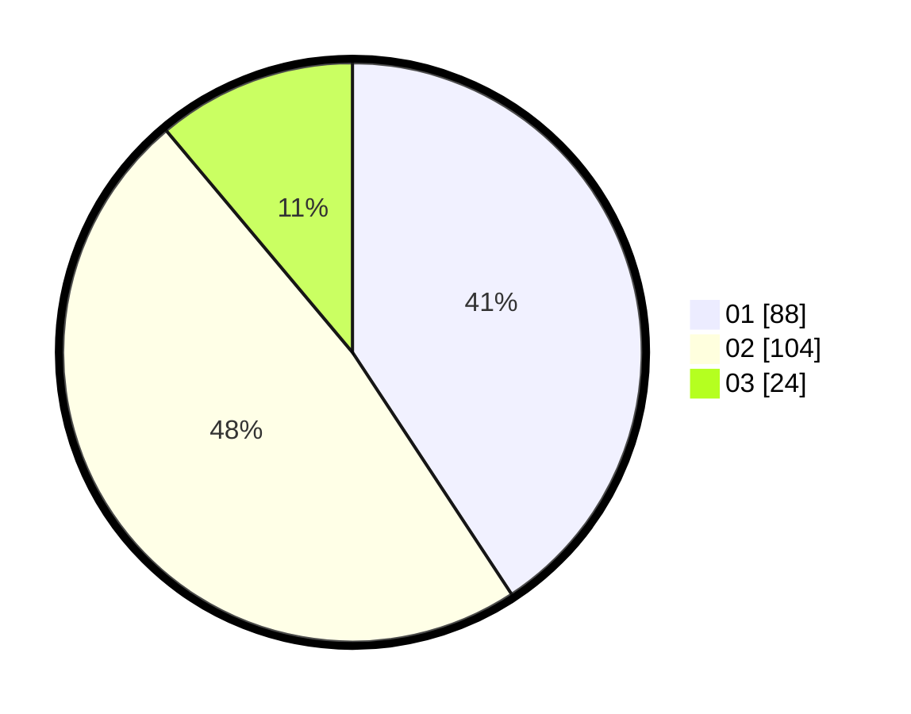

# Hasil

Hasil perolehan suara paslon dapat dilihat pada file paslon-01.txt, paslon-02.txt, dan paslon-03.txt.

Jika tidak ada, artinya data tersebut belum ada pada SIREKAP.

## Perolehan Suara

 * Paslon 01: **88**.
 * Paslon 02: **104**.
 * Paslon 03: **24**.

## Foto C Plano

https://sirekap-obj-formc.kpu.go.id/e882/pemilu/ppwp/31/75/09/10/01/3175091001101-20240216-134641--f64c44ec-9d01-4453-bafd-589cc7c79720.jpg

https://sirekap-obj-formc.kpu.go.id/e882/pemilu/ppwp/31/75/09/10/01/3175091001101-20240216-134642--05876881-a8e2-4656-abb3-ac7c02724c11.jpg

https://sirekap-obj-formc.kpu.go.id/e882/pemilu/ppwp/31/75/09/10/01/3175091001101-20240216-134642--aeeccb86-4d1c-460d-b6d1-6c0ba5599559.jpg

## DATA PEMILIH TETAP

Jumlah pemilih dalam DPT: **280**.
 * L: **136**.
 * P: **144**.

## DATA PENGGUNA HAK PILIH

Jumlah pengguna hak pilih dalam DPT: **215**.
 * L: **101**.
 * P: **114**.

Jumlah pengguna hak pilih dalam DPTb: **1**.
 * L: **1**.
 * P: **0**.

Jumlah pengguna hak pilih dalam DPK: **2**.
 * L: **0**.
 * P: **2**.

Jumlah pengguna hak pilih: **218**.
 * L: **102**.
 * P: **116**.

## JUMLAH SUARA SAH DAN TIDAK SAH

JUMLAH SELURUH SUARA SAH: **216**.

JUMLAH SUARA TIDAK SAH: **2**.

JUMLAH SELURUH SUARA SAH DAN SUARA TIDAK SAH: **218**.
