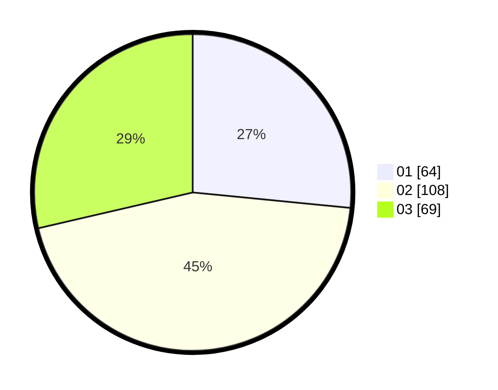

# Hasil

Hasil perolehan suara paslon dapat dilihat pada file paslon-01.txt, paslon-02.txt, dan paslon-03.txt.

Jika tidak ada, artinya data tersebut belum ada pada SIREKAP.

## Perolehan Suara

 * Paslon 01: **64**.
 * Paslon 02: **108**.
 * Paslon 03: **69**.

## Foto C Plano

https://sirekap-obj-formc.kpu.go.id/b8ed/pemilu/ppwp/31/75/09/10/01/3175091001106-20240215-201030--16232f5c-4e14-45fb-86a7-afef2b7fd70f.jpg

https://sirekap-obj-formc.kpu.go.id/b8ed/pemilu/ppwp/31/75/09/10/01/3175091001106-20240215-201052--5b0f9c33-cfc5-4a2a-893a-2d4e55678adc.jpg

https://sirekap-obj-formc.kpu.go.id/b8ed/pemilu/ppwp/31/75/09/10/01/3175091001106-20240215-201041--0c60a5ee-3924-4a5c-bbfc-a5a059a92d92.jpg

## DATA PEMILIH TETAP

Jumlah pemilih dalam DPT: **286**.
 * L: **140**.
 * P: **146**.

## DATA PENGGUNA HAK PILIH

Jumlah pengguna hak pilih dalam DPT: **239**.
 * L: **114**.
 * P: **125**.

Jumlah pengguna hak pilih dalam DPTb: **2**.
 * L: **2**.
 * P: **0**.

Jumlah pengguna hak pilih dalam DPK: **2**.
 * L: **1**.
 * P: **1**.

Jumlah pengguna hak pilih: **243**.
 * L: **117**.
 * P: **126**.

## JUMLAH SUARA SAH DAN TIDAK SAH

JUMLAH SELURUH SUARA SAH: **241**.

JUMLAH SUARA TIDAK SAH: **2**.

JUMLAH SELURUH SUARA SAH DAN SUARA TIDAK SAH: **243**.
