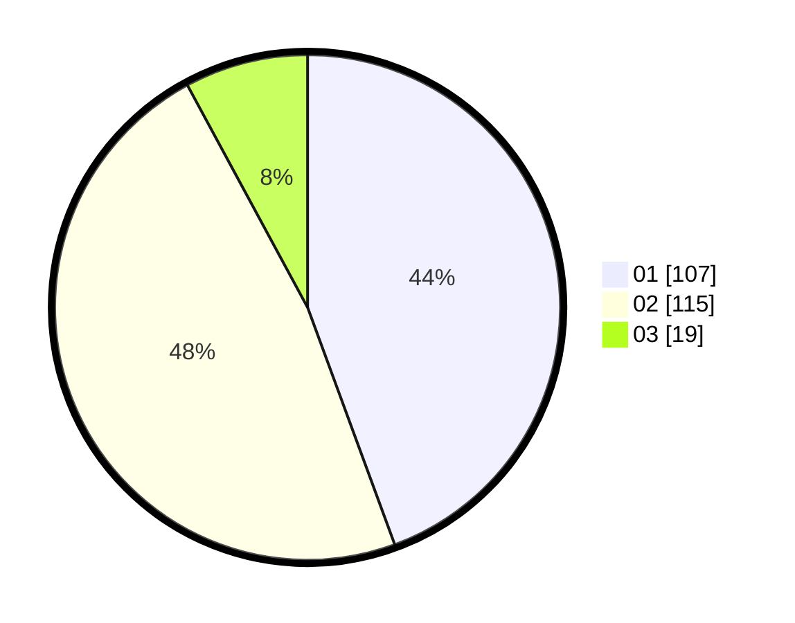

# Hasil

Hasil perolehan suara paslon dapat dilihat pada file paslon-01.txt, paslon-02.txt, dan paslon-03.txt.

Jika tidak ada, artinya data tersebut belum ada pada SIREKAP.

## Perolehan Suara

 * Paslon 01: **107**.
 * Paslon 02: **115**.
 * Paslon 03: **19**.

## Foto C Plano

https://sirekap-obj-formc.kpu.go.id/22ca/pemilu/ppwp/31/75/09/10/01/3175091001110-20240216-120104--ff5a473e-4a6a-45c8-a5e0-01450bb935d6.jpg

https://sirekap-obj-formc.kpu.go.id/22ca/pemilu/ppwp/31/75/09/10/01/3175091001110-20240216-120106--318d3200-32f0-4fb5-bccc-44c57c60fba2.jpg

https://sirekap-obj-formc.kpu.go.id/22ca/pemilu/ppwp/31/75/09/10/01/3175091001110-20240216-120105--9d1765ca-85d4-4ba8-81d4-384b9d8bd60b.jpg

## DATA PEMILIH TETAP

Jumlah pemilih dalam DPT: **284**.
 * L: **142**.
 * P: **142**.

## DATA PENGGUNA HAK PILIH

Jumlah pengguna hak pilih dalam DPT: **242**.
 * L: **116**.
 * P: **126**.

Jumlah pengguna hak pilih dalam DPTb: **0**.
 * L: **0**.
 * P: **0**.

Jumlah pengguna hak pilih dalam DPK: **1**.
 * L: **0**.
 * P: **1**.

Jumlah pengguna hak pilih: **243**.
 * L: **116**.
 * P: **127**.

## JUMLAH SUARA SAH DAN TIDAK SAH

JUMLAH SELURUH SUARA SAH: **241**.

JUMLAH SUARA TIDAK SAH: **2**.

JUMLAH SELURUH SUARA SAH DAN SUARA TIDAK SAH: **243**.
