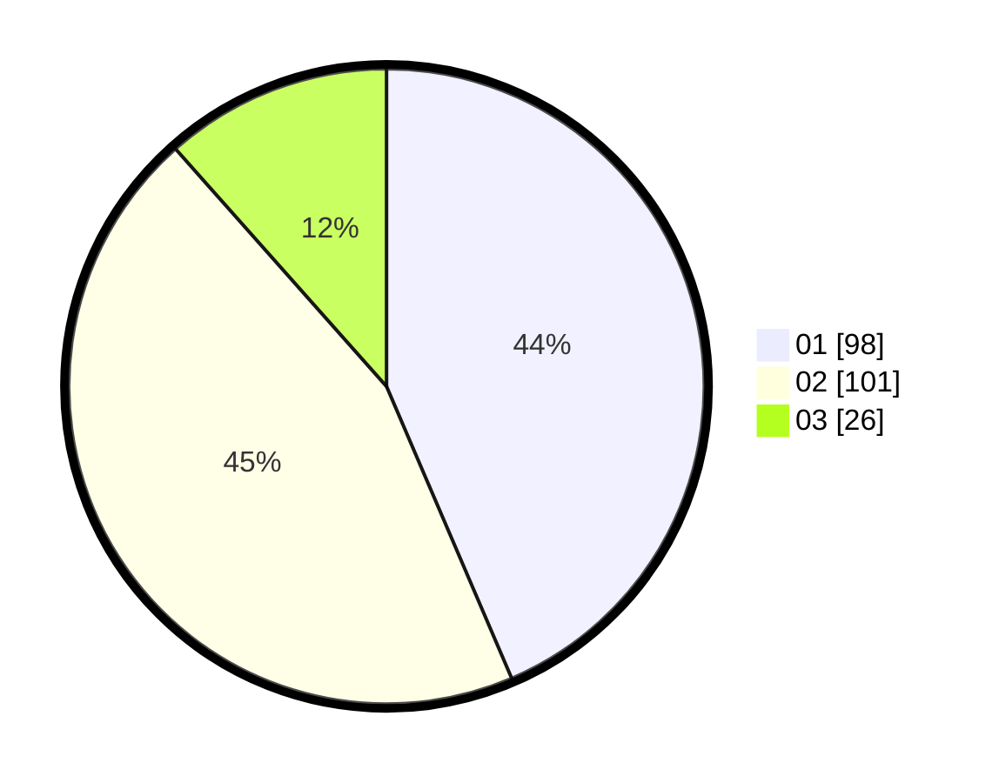

# Hasil

Hasil perolehan suara paslon dapat dilihat pada file paslon-01.txt, paslon-02.txt, dan paslon-03.txt.

Jika tidak ada, artinya data tersebut belum ada pada SIREKAP.

## Perolehan Suara

 * Paslon 01: **98**.
 * Paslon 02: **101**.
 * Paslon 03: **26**.

## Foto C Plano

https://sirekap-obj-formc.kpu.go.id/69be/pemilu/ppwp/31/75/09/10/01/3175091001112-20240214-230534--43e3236a-0fdb-4c08-943c-c7653f6d847f.jpg

https://sirekap-obj-formc.kpu.go.id/69be/pemilu/ppwp/31/75/09/10/01/3175091001112-20240214-230726--aa27de7a-6087-4355-b6ce-b28d1708bea6.jpg

https://sirekap-obj-formc.kpu.go.id/69be/pemilu/ppwp/31/75/09/10/01/3175091001112-20240214-230832--62ffb3b6-f533-409b-8bb1-745baf654c29.jpg
