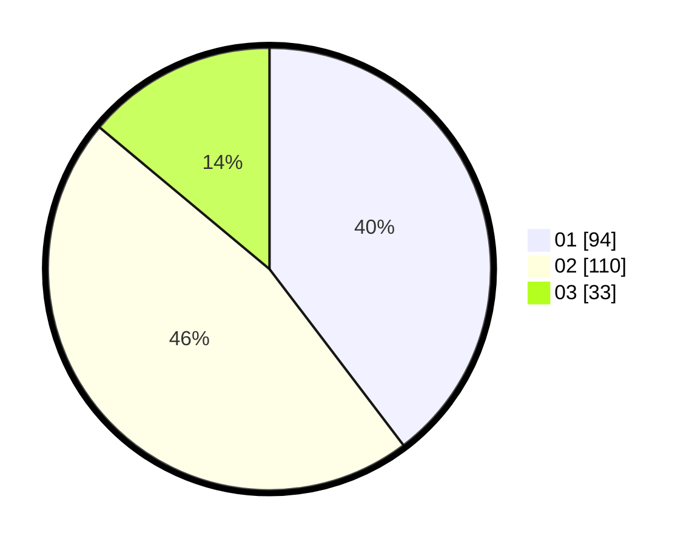

# Hasil

Hasil perolehan suara paslon dapat dilihat pada file paslon-01.txt, paslon-02.txt, dan paslon-03.txt.

Jika tidak ada, artinya data tersebut belum ada pada SIREKAP.

## Perolehan Suara

 * Paslon 01: **94**.
 * Paslon 02: **110**.
 * Paslon 03: **33**.

## Foto C Plano

https://sirekap-obj-formc.kpu.go.id/6622/pemilu/ppwp/31/75/09/10/01/3175091001113-20240214-221221--1d450216-0ded-4300-ad2c-27daac14f2ca.jpg

https://sirekap-obj-formc.kpu.go.id/6622/pemilu/ppwp/31/75/09/10/01/3175091001113-20240214-221631--a50597dd-34e0-40eb-95a3-48abb47ffe53.jpg

https://sirekap-obj-formc.kpu.go.id/6622/pemilu/ppwp/31/75/09/10/01/3175091001113-20240214-221826--e6b7dc43-c909-4c97-88b7-f873f59f59c3.jpg
