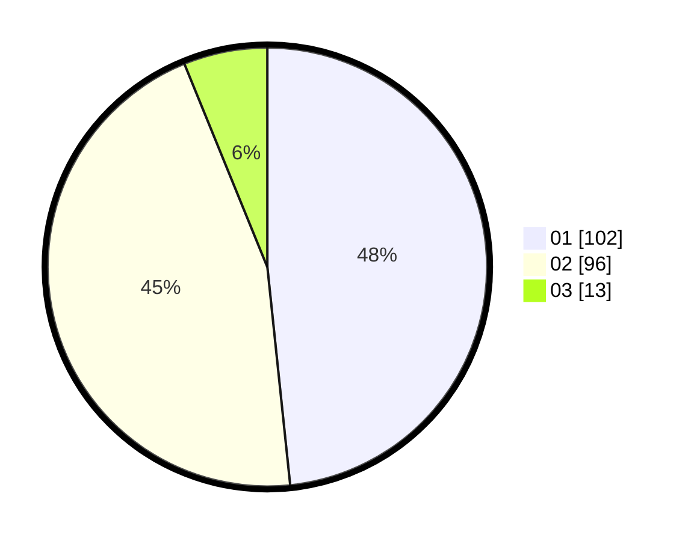

# Hasil

Hasil perolehan suara paslon dapat dilihat pada file paslon-01.txt, paslon-02.txt, dan paslon-03.txt.

Jika tidak ada, artinya data tersebut belum ada pada SIREKAP.

## Perolehan Suara

 * Paslon 01: **102**.
 * Paslon 02: **96**.
 * Paslon 03: **13**.

## Foto C Plano

https://sirekap-obj-formc.kpu.go.id/850f/pemilu/ppwp/31/75/09/10/01/3175091001120-20240214-214356--f42c0a2a-ec8f-4a2f-927c-9578bd77c4c5.jpg

https://sirekap-obj-formc.kpu.go.id/850f/pemilu/ppwp/31/75/09/10/01/3175091001120-20240214-214526--c153170c-17dc-4fa7-b62e-aa7a246e538e.jpg

https://sirekap-obj-formc.kpu.go.id/850f/pemilu/ppwp/31/75/09/10/01/3175091001120-20240214-214622--0727c8a5-095b-4614-88c7-31a4c4e1c7d6.jpg

## DATA PEMILIH TETAP

Jumlah pemilih dalam DPT: **266**.
 * L: **133**.
 * P: **133**.

## DATA PENGGUNA HAK PILIH

Jumlah pengguna hak pilih dalam DPT: **210**.
 * L: **97**.
 * P: **113**.

Jumlah pengguna hak pilih dalam DPTb: **2**.
 * L: **1**.
 * P: **1**.

Jumlah pengguna hak pilih dalam DPK: **0**.
 * L: **0**.
 * P: **0**.

Jumlah pengguna hak pilih: **212**.
 * L: **98**.
 * P: **114**.

## JUMLAH SUARA SAH DAN TIDAK SAH

JUMLAH SELURUH SUARA SAH: **211**.

JUMLAH SUARA TIDAK SAH: **1**.

JUMLAH SELURUH SUARA SAH DAN SUARA TIDAK SAH: **212**.
