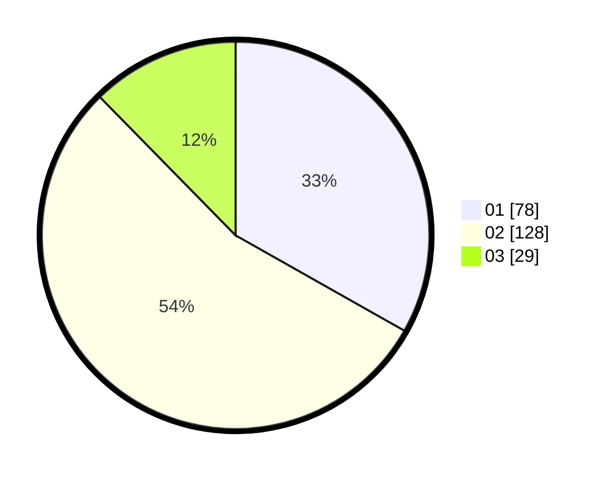

# Hasil

Hasil perolehan suara paslon dapat dilihat pada file paslon-01.txt, paslon-02.txt, dan paslon-03.txt.

Jika tidak ada, artinya data tersebut belum ada pada SIREKAP.

## Perolehan Suara

 * Paslon 01: **78**.
 * Paslon 02: **128**.
 * Paslon 03: **29**.

## Foto C Plano

https://sirekap-obj-formc.kpu.go.id/4129/pemilu/ppwp/31/75/09/10/01/3175091001124-20240214-225402--b2ccfcb8-59fe-4333-85f1-cf0eea4f7b23.jpg

https://sirekap-obj-formc.kpu.go.id/4129/pemilu/ppwp/31/75/09/10/01/3175091001124-20240214-225514--dcd33b1f-4ef6-4b9d-b20b-6c3a8804ae0b.jpg

https://sirekap-obj-formc.kpu.go.id/4129/pemilu/ppwp/31/75/09/10/01/3175091001124-20240215-203202--ed804175-59e1-478c-984f-1a465c932745.jpg

## DATA PEMILIH TETAP

Jumlah pemilih dalam DPT: **268**.
 * L: **140**.
 * P: **128**.

## DATA PENGGUNA HAK PILIH

Jumlah pengguna hak pilih dalam DPT: **237**.
 * L: **120**.
 * P: **747**.

Jumlah pengguna hak pilih dalam DPTb: **0**.
 * L: **700**.
 * P: **0**.

Jumlah pengguna hak pilih dalam DPK: **1**.
 * L: **0**.
 * P: **1**.

Jumlah pengguna hak pilih: **238**.
 * L: **120**.
 * P: **118**.

## JUMLAH SUARA SAH DAN TIDAK SAH

JUMLAH SELURUH SUARA SAH: **235**.

JUMLAH SUARA TIDAK SAH: **3**.

JUMLAH SELURUH SUARA SAH DAN SUARA TIDAK SAH: **238**.
