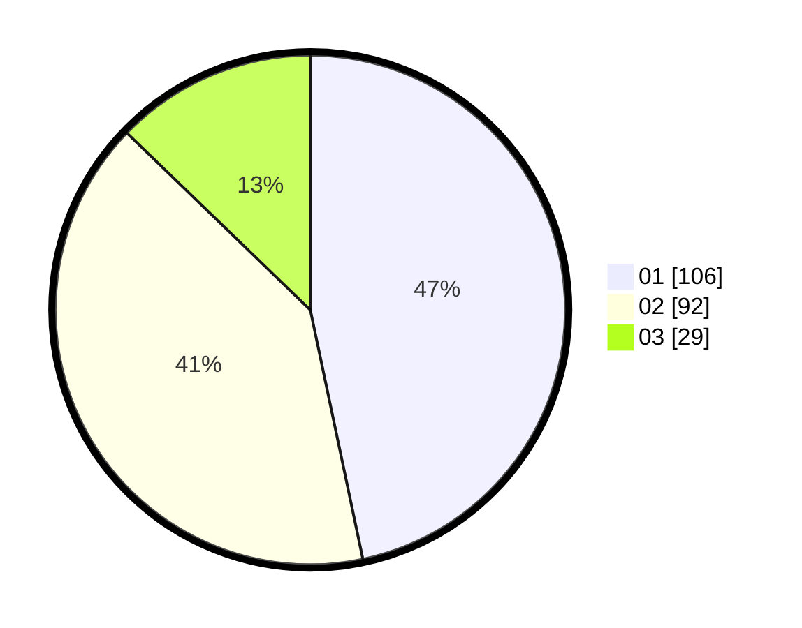

# Hasil

Hasil perolehan suara paslon dapat dilihat pada file paslon-01.txt, paslon-02.txt, dan paslon-03.txt.

Jika tidak ada, artinya data tersebut belum ada pada SIREKAP.

## Perolehan Suara

 * Paslon 01: **106**.
 * Paslon 02: **92**.
 * Paslon 03: **29**.

## Foto C Plano

https://sirekap-obj-formc.kpu.go.id/96d0/pemilu/ppwp/31/75/09/10/01/3175091001128-20240215-174332--af16125b-5d63-4774-a0ff-ca6e29988fea.jpg

https://sirekap-obj-formc.kpu.go.id/96d0/pemilu/ppwp/31/75/09/10/01/3175091001128-20240214-215755--844ad8b3-3dbd-4145-9169-f7a736ee86f0.jpg

https://sirekap-obj-formc.kpu.go.id/96d0/pemilu/ppwp/31/75/09/10/01/3175091001128-20240214-205212--43270449-17f6-4038-84f4-47dd05daeb2c.jpg
