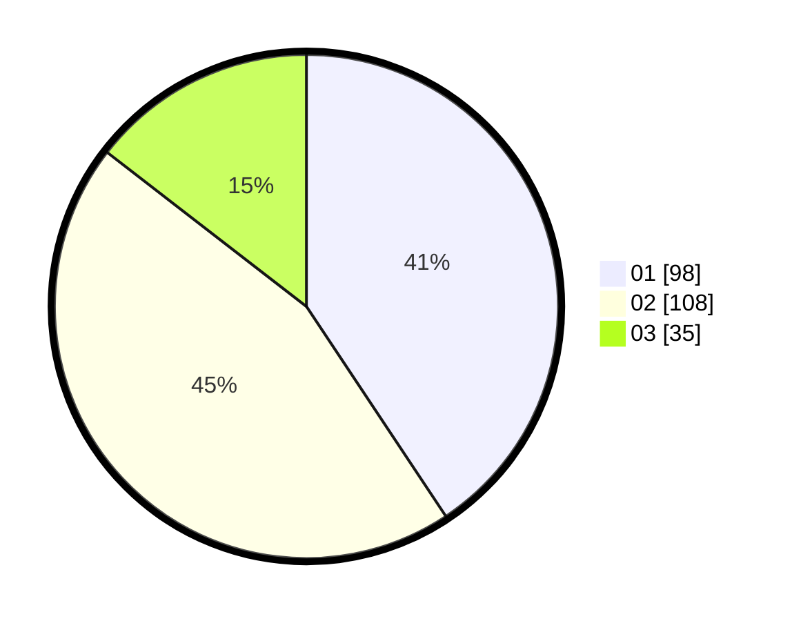

# Hasil

Hasil perolehan suara paslon dapat dilihat pada file paslon-01.txt, paslon-02.txt, dan paslon-03.txt.

Jika tidak ada, artinya data tersebut belum ada pada SIREKAP.

## Perolehan Suara

 * Paslon 01: **98**.
 * Paslon 02: **108**.
 * Paslon 03: **35**.

## Foto C Plano

https://sirekap-obj-formc.kpu.go.id/a73b/pemilu/ppwp/31/75/09/10/01/3175091001130-20240214-203222--15fb14f7-fca9-4a9d-b59f-61669398668d.jpg

https://sirekap-obj-formc.kpu.go.id/a73b/pemilu/ppwp/31/75/09/10/01/3175091001130-20240214-195748--d7749724-3d76-444e-901d-0b6802a5b8c5.jpg

https://sirekap-obj-formc.kpu.go.id/a73b/pemilu/ppwp/31/75/09/10/01/3175091001130-20240214-201550--c760b229-d96f-4b7e-a8ba-959265c7f0b6.jpg
