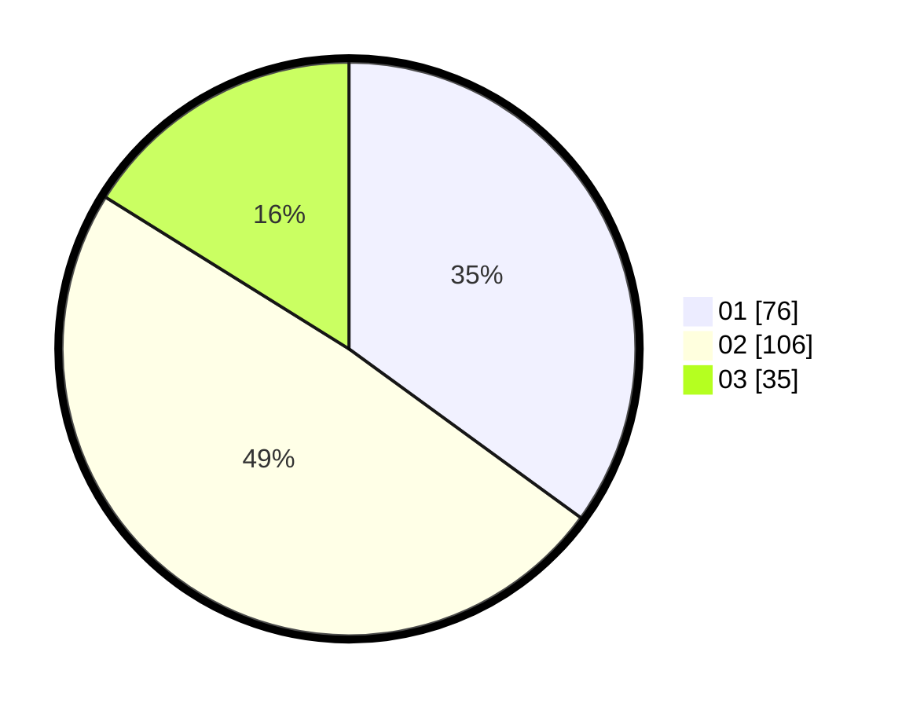

# Hasil

Hasil perolehan suara paslon dapat dilihat pada file paslon-01.txt, paslon-02.txt, dan paslon-03.txt.

Jika tidak ada, artinya data tersebut belum ada pada SIREKAP.

## Perolehan Suara

 * Paslon 01: **76**.
 * Paslon 02: **106**.
 * Paslon 03: **35**.

## Foto C Plano

https://sirekap-obj-formc.kpu.go.id/40d9/pemilu/ppwp/31/75/09/10/01/3175091001132-20240216-194045--635b12fb-6250-4739-86c8-a8b00571e51f.jpg

https://sirekap-obj-formc.kpu.go.id/40d9/pemilu/ppwp/31/75/09/10/01/3175091001132-20240216-194047--8c0be7c4-ece9-48d8-9225-95d28c7b4edf.jpg

https://sirekap-obj-formc.kpu.go.id/40d9/pemilu/ppwp/31/75/09/10/01/3175091001132-20240216-194046--207b6524-f139-4e7e-915f-6f6d0bda5c3c.jpg

## DATA PEMILIH TETAP

Jumlah pemilih dalam DPT: **282**.
 * L: **146**.
 * P: **136**.

## DATA PENGGUNA HAK PILIH

Jumlah pengguna hak pilih dalam DPT: **218**.
 * L: **108**.
 * P: **110**.

Jumlah pengguna hak pilih dalam DPTb: **0**.
 * L: **0**.
 * P: **0**.

Jumlah pengguna hak pilih dalam DPK: **0**.
 * L: **0**.
 * P: **0**.

Jumlah pengguna hak pilih: **218**.
 * L: **108**.
 * P: **110**.

## JUMLAH SUARA SAH DAN TIDAK SAH

JUMLAH SELURUH SUARA SAH: **217**.

JUMLAH SUARA TIDAK SAH: **1**.

JUMLAH SELURUH SUARA SAH DAN SUARA TIDAK SAH: **218**.
