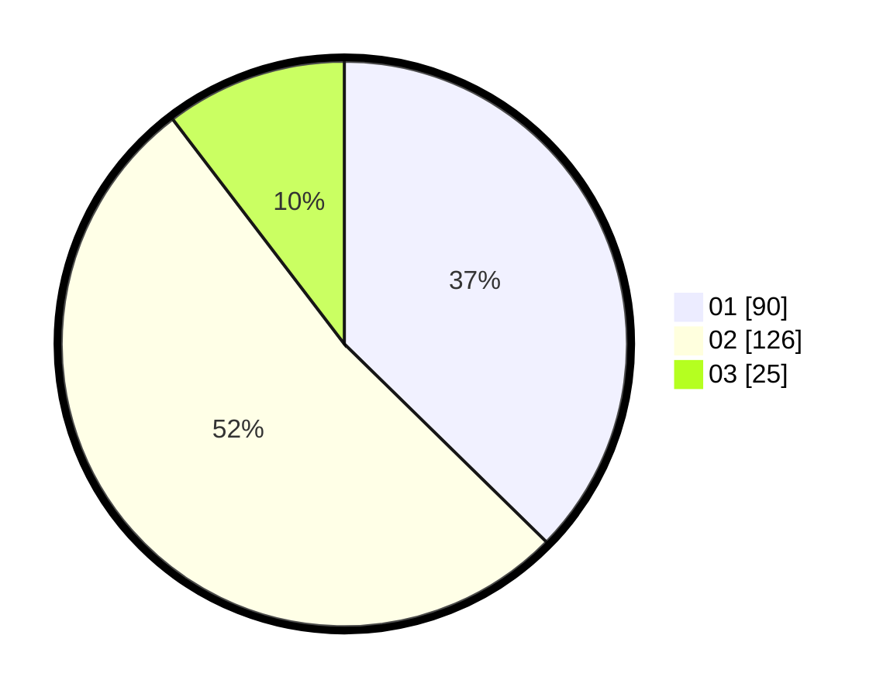

# Hasil

Hasil perolehan suara paslon dapat dilihat pada file paslon-01.txt, paslon-02.txt, dan paslon-03.txt.

Jika tidak ada, artinya data tersebut belum ada pada SIREKAP.

## Perolehan Suara

 * Paslon 01: **90**.
 * Paslon 02: **126**.
 * Paslon 03: **25**.

## Foto C Plano

https://sirekap-obj-formc.kpu.go.id/9f94/pemilu/ppwp/31/75/09/10/01/3175091001139-20240214-233514--8631baef-c45a-421d-82e8-5835523baace.jpg

https://sirekap-obj-formc.kpu.go.id/9f94/pemilu/ppwp/31/75/09/10/01/3175091001139-20240214-233838--5035dc66-bcc6-4715-849a-5efdff5dc0d8.jpg

https://sirekap-obj-formc.kpu.go.id/9f94/pemilu/ppwp/31/75/09/10/01/3175091001139-20240214-233941--da5ba6be-5fbb-405f-ab4c-f4abe83c4eae.jpg
