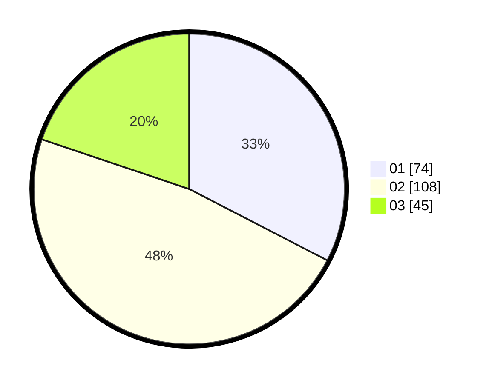

# Hasil

Hasil perolehan suara paslon dapat dilihat pada file paslon-01.txt, paslon-02.txt, dan paslon-03.txt.

Jika tidak ada, artinya data tersebut belum ada pada SIREKAP.

## Perolehan Suara

 * Paslon 01: **74**.
 * Paslon 02: **108**.
 * Paslon 03: **45**.

## Foto C Plano

https://sirekap-obj-formc.kpu.go.id/e68f/pemilu/ppwp/31/75/09/10/01/3175091001143-20240214-210547--9f025ebc-dc52-4480-8682-799f394ee8b8.jpg

https://sirekap-obj-formc.kpu.go.id/e68f/pemilu/ppwp/31/75/09/10/01/3175091001143-20240214-210652--dcac0ace-f0ad-4258-b7ff-d25f3bfeb173.jpg

https://sirekap-obj-formc.kpu.go.id/e68f/pemilu/ppwp/31/75/09/10/01/3175091001143-20240214-210734--85e246dd-45f8-434a-90c3-9d32ea4f22b5.jpg

## DATA PEMILIH TETAP

Jumlah pemilih dalam DPT: **293**.
 * L: **141**.
 * P: **152**.

## DATA PENGGUNA HAK PILIH

Jumlah pengguna hak pilih dalam DPT: **235**.
 * L: **112**.
 * P: **123**.

Jumlah pengguna hak pilih dalam DPTb: **0**.
 * L: **0**.
 * P: **0**.

Jumlah pengguna hak pilih dalam DPK: **0**.
 * L: **0**.
 * P: **0**.

Jumlah pengguna hak pilih: **235**.
 * L: **112**.
 * P: **123**.

## JUMLAH SUARA SAH DAN TIDAK SAH

JUMLAH SELURUH SUARA SAH: **232**.

JUMLAH SUARA TIDAK SAH: **3**.

JUMLAH SELURUH SUARA SAH DAN SUARA TIDAK SAH: **235**.
